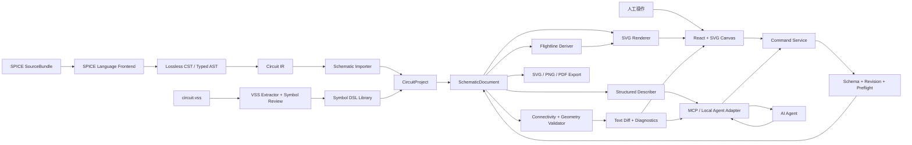
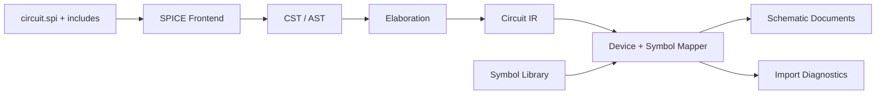
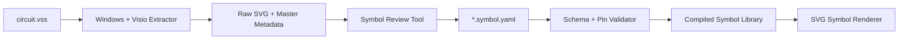
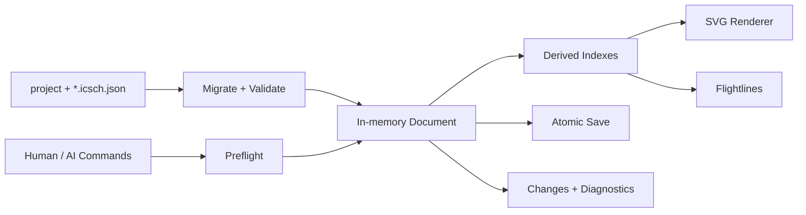

# AI / 人工协同电路画布：整体方案

## 1. 产品定义

本项目不是通用绘图软件，也不是全自动网表绘图器，而是：

> 一个只针对电路原理图的轻量、connectivity-aware 编辑器。它能够无损读取完整 SPICE 输入，通过网表建立器件、terminal 和 net；未被实体线路表达的逻辑连接以动态虚连线显示，由人和 AI 共同完成器件放置、实体布线、标注和局部整理。

核心特征：

- 交互原则参考 Cadence Virtuoso，而不是 Visio；
- SPICE 是正式的一等输入格式，而不是只处理当前样例的临时解析器；
- 网表导入建立逻辑电路，不强制自动布局或自动布线；
- 页面布局保持通用和人工可控，不强制电源、输入、输出或器件组采用固定方位；
- 无论内容由人工还是 AI 创建，Wire、Junction、器件编号、net label 和 annotation 默认使用统一的教材式黑白图形语言；
- 未完成的可见连接使用动态虚连线；
- 连接点由显式 junction 小圆点表达，没有小圆点的交叉就是 crossing；
- 人工和 AI 共用同一套领域命令、校验和历史机制；
- AI 主要读取程序提取的结构化文本，截图只负责视觉复核；
- SVG 是交互视图，不是数据真值；
- `circuit.vss` 是初始符号外观来源，通过一次性工具转换为 Symbol DSL，不进入产品运行时；
- 当前 Net-painting Converter 可作为 importer、符号、导出器和验证逻辑的迁移来源，但不再决定产品模型。

## 2. 产品边界

### 2.1 第一阶段要解决的问题

```text
完整读取 SPICE
→ 提取层级、器件、terminal 和 net
→ 器件进入待放置区
→ 人工放置并观察虚连线
→ 人工绘制明确的实体线路和 junction
→ 线路、标签和 annotation 以统一默认风格渲染
→ AI 读取结构化上下文并执行 typed commands
→ 程序验证 connectivity 与 geometry
→ 人工继续编辑、保存和导出
```

### 2.2 第一阶段不承担的目标

- 不实现 SPICE 仿真器；
- 不求解 DC、AC、transient、noise 或器件模型；
- 不把自动布局作为导入前置条件；
- 不把自动布线作为核心正确性来源；
- 不把参考图中的器件方位、信号流方向或紧凑排布固化为通用布局规则；
- 不从 SVG 几何反推电气 connectivity；
- 不复刻完整 Cadence 功能集；
- 不在第一阶段承诺多人实时协作、bus、多页跨页连接或 VSDX 完整编辑兼容。

## 3. 总体架构



最重要的产品闭环是：

```text
SPICE → Logical Connectivity → Flightlines
                                ↓
                         人工 / AI 放置
                                ↓
                         人工 / AI 布线
                                ↓
                     Deterministic Verification
                                ↓
                          Text Diff / UI
```

## 4. 真值边界

### 4.1 SPICE SourceBundle：输入来源

SourceBundle 保存导入时的原始 SPICE 文件、include 图、dialect 和内容 hash。它负责：

- 无损保留原始输入；
- 提供 source span 和诊断位置；
- 支持未来的重新导入、结构 diff 和网表 patch/export；
- 记录 logical connectivity 的来源。

导入成功后，当前项目内的逻辑编辑以 `SchematicDocument` 为准。原始 SourceBundle 不会在用户移动器件或绘制线路时被隐式改写。

### 4.2 Symbol DSL：器件符号真值

Symbol DSL 定义：

- 器件外观；
- bbox；
- 具名 pin；
- pin role；
- pin anchor；
- 合法出线方向；
- 支持的旋转与镜像；
- source provenance 和 symbol version。

```yaml
id: nmos4
kind: nmos
version: 1

source:
  kind: visio-master
  file: circuit.vss
  master: NMOS4

bbox: {x: -24, y: -36, width: 48, height: 72}

primitives:
  - {kind: line, from: [-8, -20], to: [-8, 20], role: channel}
  - {kind: line, from: [-24, 0], to: [-8, 0], role: gate}

pins:
  - {name: D, role: drain, at: [0, -36], direction: up}
  - {name: G, role: gate, at: [-24, 0], direction: left}
  - {name: S, role: source, at: [0, 36], direction: down}
  - {name: B, role: bulk, at: [24, 0], direction: right}
```

### 4.3 Logical Connectivity：电路真值

Logical Connectivity 定义 terminal 属于哪个 net：

```text
M1.G ∈ IN
M1.D ∈ OUT
M1.S ∈ VSS
M1.B ∈ VSS
```

它最初来自 SPICE，也可以由人工或 AI 通过明确的连接命令修改。器件是否已经放置、页面是否存在实体 Route，都不改变这层关系。

### 4.4 Visible Geometry：画面真值

Visible Geometry 持久化：

- 器件位置和方向；
- Route branch 和 waypoint；
- 显式 junction；
- 具备语义类型、attachment 和 placement 的 annotation；
- instance、net、power label；
- current/voltage annotation；
- 人工锁定的 segment 和 trunk。

Document 保存图形对象的语义角色和人工位置，不保存渲染后的 SVG，也不在每个对象上重复保存字体、线宽和颜色。默认视觉 token 由内置主题 `textbook-monochrome-v1` 统一提供。主题只控制图形语言，不决定器件应放在页面哪个方向。

### 4.5 Session State：临时状态

Session State 包含：

- selection；
- viewport；
- active tool；
- wire draft；
- hover pin/segment；
- 当前高亮 net；
- flightline 显示过滤；
- 未提交的交互预览。

Session State 默认不进入正式 schematic 文件，只进入本地 session/recovery 数据。

## 5. 项目、Document 与 Page

整体层级为：

```text
CircuitProject
└── SchematicDocument / CellDocument
    └── SchematicPage
        ├── Instance
        ├── Net
        ├── RouteBranch
        ├── Junction
        └── Annotation
```

一个 SPICE `.subckt` 对应一个 `SchematicDocument`。MVP 中一个 Document 只使用一个 Page，但格式预留多 Page。

```typescript
interface CircuitProject {
  schemaVersion: number
  id: string
  name: string

  sources: SourceReference[]
  symbolLibraries: SymbolLibraryReference[]

  topDocumentId: string
  documents: SchematicDocumentReference[]
}

interface SchematicDocument {
  schemaVersion: number
  id: string
  name: string
  revision: number

  sourceBinding?: {
    sourceBundleId: string
    subcircuitName: string
  }

  sourceStatus:
    | "in-sync"
    | "geometry-only-changed"
    | "connectivity-modified"

  ports: Port[]
  pages: SchematicPage[]
}

interface SchematicPage {
  id: string
  name: string
  themeId: string

  instances: Instance[]
  nets: Net[]
  routes: RouteBranch[]
  junctions: Junction[]
  annotations: Annotation[]
}
```

`themeId` 固定页面的正式渲染契约，默认值为 `textbook-monochrome-v1`，保证人工编辑、AI 命令和不同导出器得到一致图形语言；它不包含或推导页面布局约束。

### 5.1 Instance

```typescript
interface Instance {
  id: string
  symbolId: string

  sourceRef?: SourceSpan

  placement: null | {
    position: Point
    rotation: 0 | 90 | 180 | 270
    mirror: "none" | "x"
  }

  properties: Record<string, string | number | boolean>
}
```

`placement: null` 表示实例已存在于逻辑电路，但尚未放到页面。

### 5.2 Net

```typescript
interface Net {
  id: string
  name?: string
  scope: "local" | "global"

  terminals: Array<{
    instanceId: string
    pinName: string
  }>

  ports: string[]
}
```

### 5.3 RouteBranch

```typescript
type RouteEndpoint =
  | {kind: "terminal"; instanceId: string; pinName: string}
  | {kind: "port"; portId: string}
  | {kind: "junction"; junctionId: string}

interface RouteBranch {
  id: string
  netId: string
  styleRole: "wire"

  from: RouteEndpoint
  to: RouteEndpoint
  waypoints: Point[]

  segmentModes: Array<
    "auto" | "escape" | "manual" | "locked" | "trunk"
  >
}
```

`waypoints` 不包含 endpoint 坐标，Route 的实际端点位置由 terminal、port 或 junction 推导。必须定义并验证 segmentModes 与实际 segment 数的长度关系。

## 6. Junction、Endpoint 与 Crossing

用户判断 connectivity 的视觉规则是：

> 有小圆点表示 junction 和连接；没有小圆点的线路交叉就是 crossing。

程序内部通过显式 `Junction` 对象实现，而不是扫描 SVG 相交关系。

```typescript
interface Junction {
  id: string
  netId: string
  position: Point
}
```

规则：

- Junction 对象与画面上的小圆点一一对应；
- 纯几何相交不创建 Junction、不改变 connectivity；
- Wire 穿越任何线路时默认只是 crossing；
- 程序不得自动把 crossing 修正成连接；
- 用户明确点击已有 segment 作为目标时，预览并创建 Junction；
- 连接已有 segment 的命令原子执行 `split_route + add_junction + connect_route`；
- 同 net 可以创建 Junction；
- 异 net 不允许直接用 Junction 短接，必须先执行明确的 connectivity 命令；
- Route 连接到器件 pin 时通常不额外显示 junction 圆点；
- T 形或四向分支连接必须显示圆点；
- 两条共线 segment 的普通拼接可以不显示圆点。

默认图形语言下，Junction 使用与 Wire 同色的实心圆点；crossing 不画圆点、跳线弧或自动断口。圆点由独立的 `JunctionRenderer` 根据 Junction 对象渲染，不能只是 Route path 上没有数据对应的装饰。具体圆点半径和线宽来自主题 token。

关键操作语义：

| 操作 | 改变 Logical Connectivity | 改变 Visible Geometry |
|---|---:|---:|
| 移动器件 | 否 | 是 |
| Stretch 线路 | 否 | 是 |
| 删除实体 Route | 否，恢复为虚连线 | 是 |
| Disconnect terminal | 是 | 是 |
| Connect terminals | 是 | 是 |
| 在同 net Route 上增加分支 Junction | 否 | 是 |
| 把两个不同 net 合并 | 是 | 是 |
| 无圆点 crossing | 否 | 是 |

## 7. 完整 SPICE 支持

### 7.1 产品承诺

本项目对 SPICE 的目标定义为：

> 支持完整 SPICE 文本的无损读取；以 SPICE3/ngspice 为首个完整语法基线，支持所有器件与指令的结构解析；通过 dialect 插件扩展 HSPICE、PSpice、LTspice 和 Xyce。无法识别的厂商扩展仍被完整保留，不影响其他电路结构导入。

SPICE 并不存在唯一统一的全语法，因此兼容性必须通过 dialect 和版本声明，而不是使用一个模糊的 `spice: true` 标志。

### 7.2 四层兼容级别

#### L0：无损读取

保存所有原始信息：

- 注释、空白与换行；
- 原始大小写；
- continuation；
- include/lib；
- control block；
- 未知 directive；
- 厂商扩展；
- source span。

未知语句也必须保留：

```typescript
interface OpaqueStatement {
  kind: "opaque"
  rawText: string
  sourceSpan: SourceSpan
  probableType?: "element" | "directive" | "control"
}
```

#### L1：完整语法树

```text
Source Text
→ Preprocessor
→ Tokens + Trivia
→ Lossless CST
→ Typed AST
```

CST 服务于 round-trip，AST 服务于结构理解。

#### L2：完整电路结构提取

对器件行提取：

- instance ID；
- node/terminal 顺序；
- model 或 subcircuit；
- value；
- parameters；
- source location；
- hierarchy。

#### L3：表达式与语义展开

支持：

- 参数作用域；
- SPICE 数值后缀；
- `{expression}` 与函数；
- model/type resolution；
- subcircuit parameter override；
- conditional/include/lib；
- global node；
- controlled source；
- behavioral source。

不负责器件模型求值和数值仿真。

### 7.3 Dialect 插件

```typescript
interface SpiceDialect {
  id: string
  version?: string

  preprocessors: SpicePreprocessor[]
  elementParsers: ElementParser[]
  directiveParsers: DirectiveParser[]
  expressionRules: ExpressionRules
  modelRegistry: ModelRegistry
  compatibilityRules: CompatibilityRule[]
}
```

初始 dialect：

```text
SPICE3
ngspice
HSPICE
PSpice
LTspice
Xyce
```

导入器允许 `Auto Detect`，但必须显示检测结果、置信度和证据，并允许用户覆盖。

### 7.4 SPICE Frontend

```text
packages/spice/
  source/
  lexer/
  cst/
  ast/
  parser/
  preprocess/
  dialects/
  elaborate/
  schematic/
  printer/
```

语言前端输出统一的 Circuit IR：

```typescript
interface CircuitIR {
  dialect: string
  topCells: string[]
  cells: CircuitCellIR[]
  models: ModelDeclaration[]
  unresolvedStatements: SourceReference[]
}

interface CircuitCellIR {
  id: string
  name: string
  ports: PortIR[]
  instances: InstanceIR[]
  nets: NetIR[]
}
```

画布、SVG Renderer、flightline 和 AI 不直接依赖具体 SPICE dialect。

### 7.5 当前 fixture 覆盖

当前 `netlists/` 已覆盖：

```text
.subckt / .ends
.include
.param
.model
comment
continuation
parameter expression
R C L D E F G H I Q S V X
hierarchical subcircuits
SKY130 subcircuit/model names
```

这些文件是项目级 acceptance fixtures，但不是完整 SPICE 语法 corpus。后续还需要从各 dialect 官方规格构建最小语法样例集。

## 8. 网表导入与同步

### 8.1 首次导入



导入规则：

1. 保存 SourceBundle 和 include graph；
2. 每个 `.subckt` 建立一个 SchematicDocument；
3. 根据 positional terminal schema 映射具名 pin；
4. 建立 net 和 hierarchy；
5. 实例初始 `placement: null`；
6. 不生成正式 Route；
7. 未知器件使用 generic block symbol；
8. 未知语句保留并产生诊断，不静默丢弃。

### 8.2 导入后的真值

导入完成后，`SchematicDocument` 是当前项目的编辑真值。原 SPICE 文件保持为 source snapshot。

用户改变 connectivity 后：

```text
sourceStatus = connectivity-modified
```

未来重新导入时必须先展示结构 diff，不允许直接覆盖：

```text
added instances
removed instances
changed terminal bindings
renamed nets
changed parameters
changed hierarchy
```

第一版可以只支持新建项目时导入，不立即实现 re-import 和网表 patch printer。

## 9. Symbol DSL 与 VSS 导入

`lib/circuit.vss` 当前包含约 101 个 Visio master，覆盖 MOS、BJT、R/L/C、VDD/GND、I/O、源、运放、开关、二极管、逻辑门、DFF、变压器和 block 等符号。

本机能够通过 Visio COM 读取该模板，因此不需要从零绘制全部符号。但大部分核心 master 没有可靠的标准 connection-point rows，外观可以自动提取，pin 名称和电气角色仍需人工确认。

### 9.1 转换流程



转换分为：

1. 枚举 VSS master；
2. 将候选 master 导出为独立 SVG；
3. 规范化 SVG path、viewBox、style 和 transform；
4. 在 Symbol Review Tool 中标记 pin anchor；
5. 填写 pin name、role、direction 和 aliases；
6. 生成 Symbol DSL；
7. 进行 schema、视觉快照和 pin transform 验证。

VSS extractor 是开发期 Windows 工具，最终运行时只读取 Symbol DSL。第一批只转换当前网表所需符号，不要求一次性完成全部 master。

### 9.2 未知器件回退

缺少专用符号不能阻止网表导入。系统为未知器件自动生成 block symbol：

```text
┌────────────────────┐
A ○                  ○ C
B ○ vendor_special  ○ D
└────────────────────┘
```

映射优先级：

```text
project mapping
→ project symbol library
→ built-in aliases
→ .subckt generated block
→ generic unresolved block
```

## 10. 虚连线

虚连线表示：

> 同一 net 中尚未被 Route、供电符号、port 或 named connector 完整表达的 routed components 之间的逻辑连接。

虚连线：

- 不属于正式 Route；
- 不改变 connectivity；
- 不默认导出；
- 不持久化具体几何；
- 根据 placement、Route、Junction 和 connector 动态生成。

### 10.1 多端 net 算法

1. 对一个 net 建立显式 visible connectivity graph；
2. terminal、port、junction 和 Route endpoint 是图节点；
3. Route 是图边；
4. 求出当前 routed components；
5. 未连接 terminal 各自成为 component；
6. 使用 component anchor 间 Manhattan distance；
7. 对 components 计算确定性 MST；
8. MST 边作为 flightline 渲染。

平局必须使用 stable ID 作为确定性 tie-breaker。

例：

```text
OUT = [M1.D, M2.D, C1.P, PORT.OUT]
```

初始：

```text
M1.D - - M2.D - - C1.P - - PORT.OUT
```

M1.D 和 M2.D 被实体 Route 连接后：

```text
[M1.D──M2.D] - - C1.P - - PORT.OUT
```

### 10.2 交互

- 点击 flightline：高亮整个 net；
- 双击：进入该 net 的 Wire Tool；
- 从任一 endpoint 开始正式布线；
- 隐藏当前或全部 flightline；
- 只显示选择器件关联的 flightline；
- 请求 AI 整理相关实例；
- 请求 AI 将 flightline 转为 Route；
- VDD/VSS 等 global net 默认弱化或隐藏。

## 11. 人工画布工作流

### 11.1 放置

```text
Palette / Unplaced Instances
→ 拖到画布
→ 网格吸附
→ place_instance / add_instance
→ 更新派生 pin 坐标
→ 重新计算 flightlines
```

从网表导入的实例调用 `place_instance`，不是重新创建实例。

### 11.2 Wire Tool

`W` 进入 Wire Tool：

```text
idle
→ source-selected
→ routing
→ waypoint-added
→ target-selected
→ commit
```

行为：

- 从 pin、port 或 junction 开始；
- 正交 L/Z 形预览；
- `Tab` 切换横向/纵向优先；
- 单击增加 waypoint；
- 穿过线路时只产生 crossing；
- 明确点击 segment 时预览 junction 小圆点；
- `Backspace` 删除最后一个 draft point；
- `Esc` 取消当前 draft；
- commit 后通过 Command Service 原子修改 Document。

### 11.3 Move、Stretch、Flightline 与 Lock

```typescript
move_instance(id, to, wireBehavior = "stretch-local")
```

Move 只重新计算器件附近的 escape segment，并保留人工 trunk。

Stretch 可以移动：

- instance 和所选线路；
- route vertex；
- 水平或垂直 segment；
- 局部 route group。

```typescript
make_flightline(routeIds)
```

`make_flightline` 删除实体几何但保留 net，flightline 自动恢复。

segment mode：

```text
auto
escape
manual
locked
trunk
```

AI、Move Tool 和局部 reroute 不得越权修改 locked segment。

### 11.4 Annotation

Annotation 不是无类型的 SVG text，而是具备领域语义、attachment 和人工 placement 的正式对象：

```typescript
type Annotation =
  | InstanceLabel
  | NetLabel
  | PowerLabel
  | PlainText
  | CurrentAnnotation
  | VoltageAnnotation
  | FigureCaption

interface RichSchematicText {
  runs: Array<{
    text: string
    italic?: boolean
    subscript?: boolean
    superscript?: boolean
  }>
}

interface LabelPlacement {
  anchor:
    | "top-left" | "top" | "top-right"
    | "left" | "center" | "right"
    | "bottom-left" | "bottom" | "bottom-right"
  offset: Point
  alignment: "start" | "middle" | "end"
  rotation: 0 | 90 | 180 | 270
  locked: boolean
}
```

#### InstanceLabel

InstanceLabel 表达 `M1`、`R3`、`C2` 等实例名称，attachment 到 instance 并随器件移动。用户拖动后保存相对 offset；manual 或 locked label 不被 AI 擅自复位。

```typescript
interface InstanceLabel {
  kind: "instance-label"
  instanceId: string
  text: RichSchematicText
  placement: LabelPlacement
  styleRole: "instance-label"
}
```

默认 Renderer 可以把 `M1` 表达为斜体前缀和较小下标，但数据层保留结构化文本，不依赖 Unicode 下标字符。

#### NetLabel 与 PowerLabel

NetLabel 表达 `Vin`、`Vout1`、`Vb` 等实际 net 名称。它默认贴近对应线路、保持水平、不带背景或边框，并且可以 attachment 到 net 或 route segment。

```typescript
interface NetLabel {
  kind: "net-label"
  netId: string
  attachment:
    | {kind: "route-segment"; routeId: string; segmentIndex: number; t: number}
    | {kind: "net"; netId: string}
    | {kind: "position"; position: Point}
  text: RichSchematicText
  placement: LabelPlacement
  styleRole: "net-label"
}
```

PowerLabel 表达 `VDD`、`VSS`、`GND`、`VREF`，可以 attachment 到 power symbol、net、route endpoint 或页面位置。NetLabel 和 PowerLabel 表达电路对象，PlainText 只负责视觉文字，三者不能混为同一种自由文本。

#### Current、Voltage 与 PlainText

CurrentAnnotation 和 VoltageAnnotation 使用与主图一致的黑色细线、小型箭头或极性标记，并可 attachment 到 instance、pin、net 或 route segment，但不改变 logical connectivity。PlainText 和 FigureCaption 只保存视觉说明。

### 11.5 默认图形语言：Textbook Monochrome

第一阶段内置并默认使用唯一正式主题：

```text
textbook-monochrome-v1
```

它统一人工与 AI 创建对象的渲染结果，但不限制用户如何摆放器件、选择信号流方向或组织页面空间。MVP 可以只实现这一套主题，数据模型保留 `styleRole`，不必立即提供主题切换 UI。

#### Theme Tokens

```typescript
interface SchematicThemeTokens {
  colors: {
    background: string
    foreground: string
    secondary: string
  }

  strokes: {
    symbol: number
    wire: number
    annotation: number
  }

  junction: {
    radius: number
    fill: string
  }

  typography: {
    serifStack: string[]
    sansStack: string[]
    instanceSize: number
    netSize: number
    annotationSize: number
    captionSize: number
  }

  spacing: {
    labelClearance: number
    defaultLeadLength: number
    pageMargin: number
  }
}
```

初始视觉契约：

```yaml
id: textbook-monochrome-v1

colors:
  background: "#ffffff"
  foreground: "#000000"
  secondary: "#888888"

strokes:
  symbol: 1
  wire: 1
  annotation: 0.8

junction:
  radius: 1.75
  fill: "#000000"

typography:
  serifStack: ["Times New Roman", "Liberation Serif", "Noto Serif", "serif"]
  sansStack: ["Arial", "Liberation Sans", "Noto Sans", "sans-serif"]
  instanceSize: 9
  netSize: 9
  annotationSize: 8
  captionSize: 8

spacing:
  labelClearance: 3
  defaultLeadLength: 8
  pageMargin: 16
```

数值是第一版设计 token，最终通过原创 SVG golden schematics 校准，而不是从低分辨率参考截图逐像素测量。

#### Route 视觉规则

```yaml
wire:
  color: foreground
  strokeWidth: wire
  lineCap: square
  lineJoin: miter
  fill: none
  defaultMode: orthogonal
  roundedCorners: false
  crossingBridge: false
```

- 正式 Route 使用黑色细实线和直角折线；
- Wire Tool 默认正交，但用户决定 waypoint 和具体布局；
- 不通过颜色区分 net；
- crossing 不画跳线弧或连接点；
- selection、hover 和 diagnostic 颜色只存在于 Session Overlay；
- Flightline 使用灰色、低透明度虚线，默认不导出。

#### Annotation 视觉规则

- InstanceLabel、NetLabel 和 PowerLabel 默认使用 serif 字体；
- instance 前缀和电气变量允许斜体，下标使用 `tspan` 或等价 rich-text 渲染；
- label 无背景、无边框、无默认 leader line；
- NetLabel 默认水平并贴近对应线路；
- label 初始位置由工具给出，用户可自由拖动并锁定；
- label collision 产生视觉诊断，不触发自动重排；
- Current/Voltage annotation 使用与主图一致的黑色细线和小型标记。

#### 正式图形与编辑 Overlay 分离

```text
正式导出层：
  routes
  junctions
  symbols
  annotations

仅编辑器层：
  flightlines
  selection overlays
  hover overlays
  diagnostics
  hit targets
```

选中对象可以使用蓝色半透明 overlay，非法连接可以使用红色 diagnostic overlay，hit target 可以是透明粗线；这些状态不能写入正式对象样式，也不能进入 SVG/PNG/PDF 导出。

```svg
<g id="layer-routes" />
<g id="layer-junctions" />
<g id="layer-symbols" />
<g id="layer-annotations" />

<g id="layer-flightlines" />
<g id="layer-selection-overlays" />
<g id="layer-diagnostics" />
<g id="layer-hit-targets" />
```

### 11.6 快捷键

| 快捷键 | 操作 |
|---|---|
| `W` | Wire |
| `M` | Move 并保持连接 |
| `S` | Stretch |
| `R` | Rotate |
| `F` | Mirror |
| `L` | Label |
| `J` | 显式 Junction |
| `X` | 切断或拆分 |
| `Tab` | 切换正交方向 |
| `Backspace` | 删除最后一个 draft point |
| `Esc` | 取消 |
| `Space` | 临时平移 |

## 12. AI 观察与修改工作流

### 12.1 结构化观察

读取接口：

```text
describe_project
describe_document
describe_page
describe_selection
describe_region
describe_instance
describe_net
describe_flightlines
describe_neighbors
describe_diagnostics
describe_changes
```

示例：

```text
DOCUMENT ota_5t PAGE main REV=42 GRID=24
SELECT=[M1]

INST M1 nmos4 AT=(288,288) ORIENT=R0
  D AT=(288,252) DIR=N NET=OUT
  G AT=(264,288) DIR=W NET=IN
  S AT=(288,324) DIR=S NET=VSS
  B AT=(312,288) DIR=E NET=VSS

NET OUT STATUS=partially-routed
  TERMINALS=[M1.D,M2.D,C1.P,PORT.OUT]

ROUTED_COMPONENT RC1
  TERMINALS=[M1.D,M2.D]
  BBOX=(288,144)-(432,252)

FLIGHTLINES
  F1 RC1 -> C1.P MANHATTAN=96

DIAGNOSTICS
  none
```

程序提取 route/segment 的 H/V、长度、bend、crossing、junction、overlap、locked、与 bbox 距离和 routing corridor。AI 不通过截图猜 pin、net 或 connectivity。

### 12.2 Command Transaction

```typescript
interface CommandTransaction {
  transactionId: string
  expectedRevision: number
  actor: {
    kind: "human" | "agent"
    id: string
  }
  dryRun?: boolean
  commands: CanvasCommand[]
}
```

```json
{
  "transactionId": "tx-1042",
  "expectedRevision": 42,
  "actor": {"kind": "agent", "id": "assistant"},
  "commands": [
    {
      "type": "move_instance",
      "instanceId": "C1",
      "to": {"x": 528, "y": 288},
      "wireBehavior": "stretch-local"
    }
  ]
}
```

### 12.3 执行闭环

```text
Observe
→ Decide
→ Schema Validation
→ Revision Check
→ Preflight / Dry Run
→ Atomic Apply
→ Deterministic Verify
→ Revision +1
→ Text Diff + Diagnostics
```

任何命令失败则整个 transaction 回滚。undo/redo 同样产生新 revision，revision 永远单调递增。

### 12.4 AI 禁止能力

```text
replace_document
set_raw_svg
rewrite_xml
eval_javascript
direct file mutation
```

## 13. 统一命令/API

### 13.1 读取

```text
get_project_summary
get_document_summary
get_selection
get_viewport
get_objects
get_instance
get_net
trace_net
get_flightlines
get_unrouted_nets
get_neighbors
get_diagnostics
get_changes_since
render_region
```

### 13.2 修改

```text
place_instance
add_instance
delete_instance
move_instance
move_selection
rotate_instance
mirror_instance

connect_terminals
disconnect_terminal
connect_terminal_to_net
merge_nets

set_route_points
move_route_vertex
move_route_segment
split_route
add_junction
remove_junction
lock_route_segment
make_flightline
route_flightline

add_instance_label
add_net_label
add_power_label
add_plain_text
add_current_annotation
add_voltage_annotation
move_annotation
set_annotation_text
set_annotation_placement
lock_annotation

undo
redo
```

## 14. 产品代码仓库结构

```text
interactive-circuit-maker/
├── apps/
│   └── editor/
│       ├── src/
│       │   ├── app/
│       │   ├── canvas/
│       │   ├── panels/
│       │   └── tools/
│       └── tests/
│
├── packages/
│   ├── schema/
│   │   ├── project-schema.ts
│   │   ├── document-schema.ts
│   │   ├── symbol-schema.ts
│   │   └── migrations/
│   ├── core/
│   │   ├── connectivity/
│   │   ├── geometry/
│   │   ├── commands/
│   │   ├── history/
│   │   ├── flightlines/
│   │   ├── describe/
│   │   └── validate/
│   ├── spice/
│   │   ├── source/
│   │   ├── lexer/
│   │   ├── cst/
│   │   ├── ast/
│   │   ├── parser/
│   │   ├── preprocess/
│   │   ├── dialects/
│   │   ├── elaborate/
│   │   ├── schematic/
│   │   └── printer/
│   ├── symbols/
│   ├── render-svg/
│   │   ├── theme/
│   │   │   ├── textbook-monochrome.ts
│   │   │   └── tokens.ts
│   │   ├── routes/
│   │   │   ├── RouteRenderer.ts
│   │   │   ├── JunctionRenderer.ts
│   │   │   └── FlightlineRenderer.ts
│   │   ├── annotations/
│   │   │   ├── AnnotationRenderer.ts
│   │   │   ├── InstanceLabelRenderer.ts
│   │   │   ├── NetLabelRenderer.ts
│   │   │   ├── PowerLabelRenderer.ts
│   │   │   ├── RichTextRenderer.ts
│   │   │   ├── CurrentAnnotationRenderer.ts
│   │   │   └── VoltageAnnotationRenderer.ts
│   │   └── overlays/
│   │       ├── SelectionOverlayRenderer.ts
│   │       ├── DiagnosticOverlayRenderer.ts
│   │       └── HitTargetRenderer.ts
│   ├── agent-protocol/
│   └── exporters/
│
├── tools/
│   ├── vss-import/
│   ├── symbol-review/
│   └── fixture-tools/
│
├── assets/
│   ├── source/visio/circuit.vss
│   └── symbols/
│
├── fixtures/
│   ├── netlists/
│   ├── spice-corpus/
│   ├── imported-documents/
│   ├── expected-connectivity/
│   ├── commands/
│   ├── expected-diagnostics/
│   └── visual-golden/
│
├── references/
│   ├── manifest.yaml
│   ├── README.md
│   └── notes/
│
├── scripts/
├── docs/
├── plan/
├── pnpm-workspace.yaml
├── package.json
└── tsconfig.base.json
```

当前资产未来迁移关系：

```text
lib/circuit.vss
→ assets/source/visio/circuit.vss

netlists/*
→ fixtures/netlists/*
```

迁移必须作为独立 target 执行，避免在架构文档提交中移动现有资产。

## 15. 用户电路项目结构

用户项目采用可读、可 diff、可进入 Git 的目录格式：

```text
my-circuit/
├── project.icproj.json
├── sources/
│   ├── circuit.spi
│   ├── models.inc
│   └── source-lock.json
├── schematics/
│   ├── top.icsch.json
│   ├── scdac_unit.icsch.json
│   └── trim_inverter.icsch.json
├── libraries/
│   └── symbols.lock.json
├── assets/
├── exports/
│   ├── top.svg
│   └── top.pdf
├── .cache/
│   ├── spice-cst/
│   ├── spice-ast/
│   ├── thumbnails/
│   └── spatial-index/
└── .session/
    ├── viewport.json
    └── recovery/
```

正式文件：

```text
project.icproj.json
sources/*
schematics/*.icsch.json
libraries/symbols.lock.json
```

派生文件：

```text
.cache/*
exports/*
```

临时文件：

```text
.session/*
```

`.cache` 和 `.session` 默认不进入 Git。

## 16. 运行时文件流

### 16.1 加载与编辑



持久化：

- instances、nets、routes、junctions、annotations；
- placement；
- revision；
- project/source/symbol bindings。

动态派生：

- pin 页面坐标；
- spatial index；
- routed components；
- flightlines；
- SVG；
- selection bbox；
- diagnostics。

### 16.2 保存

- 每个 Document 独立 revision；
- transaction 成功后 revision `+1`；
- 正式保存使用临时文件加原子替换；
- autosave 写入 `.session/recovery/`；
- schemaVersion 通过 migration 升级；
- canonical JSON 保证稳定 diff；
- Symbol Library 使用 ID、version 和 content hash 锁定。

## 17. 验证策略

### 17.1 SPICE

- lossless parse/print round-trip；
- dialect 官方最小语法 corpus；
- CST/AST golden tests；
- Circuit IR connectivity golden tests；
- include cycle、缺失文件和参数循环诊断；
- parser fuzz/property tests；
- 当前 `netlists/` 的项目级 acceptance tests。

### 17.2 Symbol

- Symbol DSL schema；
- pin name 唯一性；
- pin transform；
- bbox 和 anchor 合法性；
- VSS 转换前后视觉快照；
- rotation/mirror snapshot tests。

### 17.3 Connectivity 与 Route

- connectivity 不从几何相交推断；
- crossing 不连接；
- junction 必须显式存在；
- 每个显式 junction 在正式主题中都有对应实心圆点；
- crossing 不渲染圆点或跳线弧；
- Route endpoint 必须有效且属于同一 net；
- 删除 Route 不删除 net；
- flightline MST 可确定复现；
- locked segment 不被越权修改。

### 17.4 Command

- stale revision 拒绝；
- transaction 原子性；
- dry run 不修改 Document；
- undo/redo revision 单调；
- diff 与 diagnostics 稳定；
- save-load-save 语义稳定。

### 17.5 UI

- Playwright 覆盖放置、Wire、Junction、crossing、Move、Stretch 和 Flightline；
- 符号、Route、Junction、InstanceLabel、NetLabel、PowerLabel 和电气 annotation 使用原创 SVG golden schematics 做视觉回归；
- 验证 `textbook-monochrome-v1` 的字体角色、线宽、直角 line join、实心 junction、无边框 label 和导出页面边距；
- 验证 selection、hover、diagnostic、hit target 和 flightline overlay 不进入正式导出；
- label overlap、wire-through-label 和缺失字体产生视觉诊断，但不自动改变人工 placement；
- 截图只验证视觉表现，不承担 topology 验证。

## 18. 参考项目与边界

| 参考 | 用途 | 使用边界 |
|---|---|---|
| Cadence Virtuoso | connectivity-driven、Wire、Stretch、Detach、flightline UX | 研究行为，不复制受保护素材 |
| [JointJS Core](https://github.com/clientIO/joint) | ports、links、vertices、graph API | 原生 SVG 不足时做技术 spike |
| [CircuitPaint](https://github.com/guszhang/circuitpaint) | palette、wire vertex、标注、快捷键 UX | AGPL，reference-only，不复制进产品 |
| [OpenPencil](https://github.com/open-pencil/open-pencil) | live canvas、CLI、MCP tool 组织 | 研究架构，不继承其 Vue/Skia 技术栈 |
| [tldraw agent-template](https://github.com/tldraw/agent-template) | AI context、typed actions、history | 仅研究 agent pattern，单独审查 SDK 条款 |
| [draw.io VSS converter](https://www.drawio.com/docs/manual/import/vss-converter/) | VSS 转换实验 | 本项目优先使用本地 Visio COM，不默认上传资产 |
| 当前 Net-painting Converter | importer、符号、SVG/VSDX、validator 来源 | 按模块迁移，不继承旧数据模型 |
| `circuit.vss` | 初始符号外观 | 开发期提取，不作为运行时依赖 |

参考仓库不建议全部作为 Git submodule。项目跟踪 `references/manifest.yaml`、commit、license 和用途，通过脚本按需拉取到 gitignored 的 `.reference-src/`。

## 19. 实施顺序

```text
P0  Schema 基础
    CircuitProject + SchematicDocument + SchematicPage
    Symbol DSL + revision + migrations
↓
P1  SPICE Source/CST
    lossless lexer、continuation、comments、include、round-trip
↓
P2  SPICE AST/Circuit IR
    SPICE3/ngspice 完整结构解析、hierarchy、connectivity
↓
P3  VSS Symbol Pipeline
    master extraction、review、首批 Symbol DSL
↓
P4  SVG 人工画布
    放置、选择、移动、旋转、保存
    textbook-monochrome-v1、正式层与 Overlay 分层
↓
P5  Flightlines
    Unplaced Instances、routed components、deterministic MST
↓
P6  Wire / Junction / Crossing
    Cadence 式 Wire、Stretch、explicit junction、Detach
    黑色细实线、直角 join、实心 junction、无点 crossing
↓
P7  Annotation 与视觉回归
    InstanceLabel、NetLabel、PowerLabel、RichText
    Current/Voltage annotation、SVG golden schematics
↓
P8  Structured Describe API
    selection、region、net、diagnostics、changes
↓
P9  AI Commands
    transaction、revision、preflight、diff、verifier
↓
P10 Dialect Expansion
    HSPICE、PSpice、LTspice、Xyce
↓
P11 Export
    SVG、PNG、PDF；VSDX 后置
```

SPICE 全语法工作与画布开发采用分层交付：先完成无损接收和统一 IR，再持续扩展 dialect；不要求等待所有厂商语义完成后才验证画布闭环。

## 20. 第一版验收闭环

第一版必须证明：

```text
导入包含 hierarchy 和 include 的 SPICE
→ 原文无损保留
→ 生成 Circuit IR 和多个 SchematicDocument
→ 未知器件使用 generic symbol，不丢 connectivity
→ 实例进入 Unplaced Instances
→ 人工拖放后 flightline 动态更新
→ 人工绘制实体线路
→ crossing 保持不连接
→ 明确创建 junction 后显示小圆点并连接
→ 人工和 AI 创建的 Route、Junction 与 Annotation 使用相同的 textbook-monochrome-v1 图形语言
→ InstanceLabel、NetLabel 和 PowerLabel 使用结构化文本、可人工拖动且保存 attachment/offset
→ selection、diagnostic、hit target 和 flightline overlay 不进入正式导出
→ 删除实体 Route 后 logical net 保持、flightline 恢复
→ AI 读取结构化文本
→ AI 移动、对齐或完成局部布线
→ stale revision 被拒绝
→ 程序验证并返回 deterministic diff
→ 保存、重新打开后语义不变
```

## 21. 尚待单独决策的事项

以下事项不阻塞整体架构，但需要后续 ADR 明确：

1. 产品仓库和发布物的许可证；
2. 首个完整 dialect 基线的精确版本；
3. 网表 re-import 和 patch printer 的首发范围；
4. 一个 Document 多 Page 的连接器语义；
5. bus、arrayed instance 和跨页连接的文件格式；
6. VSS 原始素材的再分发范围和 provenance；
7. 当前 Net-painting Converter 的迁移清单；
8. VSDX exporter 的优先级和兼容目标；
9. 正式导出时的字体嵌入、替代字体和跨平台 font metric 策略。

本文档是当前产品定义、架构边界、数据模型和实施路径的统一基线。后续设计变化应通过 ADR 或 RFC 更新，不应只存在于 UI 代码或临时讨论中。
