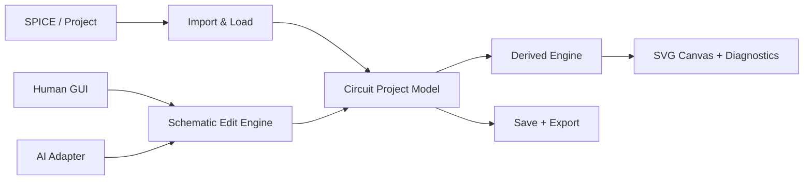

# AI / 人工协同电路画布：整体方案

## 1. 产品定义

本项目不是通用绘图软件，也不是全自动网表绘图器，而是：

> 一个面向电路原理图的轻量、connectivity-aware 编辑器。系统无损读取 SPICE，以网表建立器件、terminal 和 net；未被实体线路表达的逻辑连接通过动态虚连线显示，由人通过图形界面、AI 通过结构化操作，共同完成放置、布线、标注和局部整理。

核心原则：

- 人始终通过 React + SVG 图形界面操作，不接触命令行或 JSON；
- 人和 AI 的正式修改最终进入同一个 `Schematic Edit Engine`；
- SPICE 导入建立逻辑电路，不强制自动布局和自动布线；
- 连接关系来自显式电路对象，不从 SVG 像素或线段相交猜测；
- 分支和连接交叉由 junction 小圆点明确表达，没有小圆点的交叉就是 crossing；
- SVG 是派生视图，不是数据真值；
- AI 主要读取局部结构化上下文，截图只用于视觉复核；
- `circuit.vss` 只用于开发期生成符号库，用户运行时不依赖 Visio 或 VSS；
- 第一版默认输出统一的黑白教材式原理图风格。

## 2. 对外系统只有五个部分

内部实现可以包含 parser、索引和 renderer，但用户、AI 和宿主集成只需要理解以下五个部分：



| 部分 | 职责 |
|---|---|
| Import & Load | 导入 SPICE、加载 Project、执行 schema migration |
| Circuit Project Model | 保存逻辑 connectivity、可见几何和展示意图 |
| Schematic Edit Engine | 安全、原子、可撤销地修改 Document |
| Derived Engine | 派生 pin 坐标、索引、flightline、diagnostics 和 SVG |
| Save + Export | 保存可编辑项目，导出 SVG、PNG、PDF |

外部不需要知道 token、syntax tree、Circuit IR、MST 或 SVG layer 的内部组织。

## 3. 三条相互独立的工作流

原方案中最容易显得臃肿的原因，是把开发期工具、导入期编译和日常编辑画成一条流水线。实际系统应明确拆成三条工作流。

### 3.1 开发期符号生产

```text
circuit.vss
→ Windows/Visio Extractor
→ Raw SVG + Master Metadata
→ 人工确认 pin name/role/anchor
→ Symbol DSL
→ Compiled Built-in Symbol Library
```

该流程仅由项目开发者运行。用户打开项目时：

- 不读取 `circuit.vss`；
- 不启动 Visio；
- 不生成 Raw SVG；
- 不编辑 Symbol DSL；
- 只加载应用内置或项目自定义的 Symbol Library。

### 3.2 SPICE 导入

```text
SPICE entry + includes
→ SpiceFrontend.parse()
→ transient Circuit IR
→ SchematicImporter.import()
→ CircuitProject
```

syntax tree 和 Circuit IR 是 importer 内部内存对象，不是用户文件。

### 3.3 日常编辑

```text
打开 CircuitProject
→ 人通过 GUI Tool 操作 / AI 提交 typed edits
→ Schematic Edit Engine
→ Validate + Apply + Revision
→ Derived Engine
→ SVG / Flightlines / Diagnostics
→ 保存或导出
```

日常编辑是产品运行时主路径，不调用 VSS extractor，也不反复解析原始 SPICE。

## 4. 输入与输出

### 4.1 输入

系统只有四类输入。

#### SPICE

```text
entry.spi
included/*.inc
models/*.lib
```

用户选择入口文件，include resolver 跟随引用。默认把可复制的输入文件保存到项目 `sources/`，保证项目可移动和可复现。

```typescript
interface ImportRequest {
  entryPath: string
  dialect: "auto" | SpiceDialectId
  sourcePolicy: "copy" | "reference"
}
```

#### 已有 Project

```text
project.icproj.json
```

加载流程：

```text
read → migrate → validate → open
```

已有 Project 不再经过 SPICE importer。

#### Symbol Library

内置库随应用发布，Project 只记录 ID、version 和 content hash。只有项目自定义符号才作为独立文件存在。

#### 编辑意图

人工输入来自鼠标和键盘，AI 输入来自结构化请求。两者最终转换为相同的 typed edit。

### 4.2 输出

#### 可编辑项目

```text
project.icproj.json
```

它保存所有 Documents、connectivity、可见几何、展示意图、source manifest、symbol lock 和 revision。

#### 视觉导出

```text
SchematicDocument
→ deterministic SVG
→ SVG / PNG / PDF
```

SVG 是主导出格式，PNG 和 PDF 从同一 SVG 表达生成。

#### 程序结果

每次 edit 返回：

```json
{
  "revision": 43,
  "changedObjectIds": ["M1", "route-12"],
  "diff": "...",
  "diagnostics": []
}
```

这类结果供 UI 和 AI 使用，不写入独立文件。

## 5. 唯一持久化领域模型

第一版只保留两层：

```text
CircuitProject
└── SchematicDocument[]
```

一个 Project 对应一次完整电路工作；一个 SPICE `.subckt` 对应一个 Document。

第一版不设置 `SchematicPage`：当前一个 Document 只有一个画布，Page 只会增加 ID、查询路径、JSON 嵌套和 AI scope。真正需要多页时再通过 schema migration 引入 `views/pages`。

```typescript
interface CircuitProject {
  schemaVersion: number
  id: string
  name: string

  source: SourceManifest
  symbolLibrary: SymbolLibraryLock

  topDocumentId: string
  documents: SchematicDocument[]
}

interface SchematicDocument {
  id: string
  name: string
  revision: number

  sourceBinding?: SourceBinding
  sourceStatus:
    | "in-sync"
    | "geometry-only-changed"
    | "connectivity-modified"

  ports: Port[]
  instances: Instance[]
  nets: Net[]
  routes: RouteBranch[]
  junctions: Junction[]
  annotations: Annotation[]

  presentation: PresentationIntent
  layoutGroups: LayoutGroup[]
  constraints: LayoutConstraint[]
}
```

### 5.1 Instance 和 Net

```typescript
interface Instance {
  id: string
  symbolId: string
  symbolVariantId?: string
  sourceRef?: SourceSpan

  placement: null | {
    position: Point
    rotation: 0 | 90 | 180 | 270
    mirror: "none" | "x"
  }

  properties: Record<string, string | number | boolean>
}

interface Net {
  id: string
  name?: string
  scope: "local" | "global"
  terminals: TerminalRef[]
  ports: string[]
}
```

`placement: null` 表示实例已存在于逻辑电路，但尚未放到画布。

### 5.2 Route 和 Junction

```typescript
type RouteEndpoint =
  | {kind: "terminal"; instanceId: string; pinName: string}
  | {kind: "port"; portId: string}
  | {kind: "junction"; junctionId: string}

interface RouteBranch {
  id: string
  netId: string
  from: RouteEndpoint
  to: RouteEndpoint
  waypoints: Point[]
  segmentModes: Array<
    "auto" | "escape" | "manual" | "locked" | "trunk"
  >
}

interface Junction {
  id: string
  netId: string
  position: Point
}
```

`waypoints` 不包含 endpoint 坐标；实际端点坐标由 terminal、port 或 junction 派生。

## 6. Connectivity 与画面语义

### 6.1 真值边界

| 数据 | 性质 | 是否持久化 |
|---|---|---:|
| SPICE source manifest | 输入来源与追溯 | 是 |
| Symbol Library lock | 符号版本绑定 | 是 |
| Logical Connectivity | 电路真值 | 是 |
| Visible Geometry | 人工/AI 完成的画面 | 是 |
| Presentation Intent | 风格、约束、标注布局 | 是 |
| Selection/Viewport/Wire Draft | 临时交互状态 | 否 |
| Flightlines/Indexes/Diagnostics/SVG | 派生状态 | 否 |

导入后，`SchematicDocument` 是当前编辑真值。原始 SPICE 保留为 source snapshot，不会因移动器件或画线被隐式改写。

### 6.2 Junction 和 Crossing

用户的视觉判断规则是：

```text
同一条连续 polyline       → 连接，不需要圆点
Route 接到器件 pin        → 连接，通常不需要圆点
T 形分支                  → 必须显示 junction 圆点
X 形交叉并连接            → 必须显示 junction 圆点
X 形交叉且没有圆点        → crossing，不连接
```

程序规则：

- junction 小圆点与显式 `Junction` 对象对应；
- 单纯几何相交不创建 Junction；
- Wire 穿过线路时默认只是 crossing；
- 程序不得自动把 crossing 修正成连接；
- 用户明确点击 segment 时，GUI 显示 junction 预览；
- 提交后 Edit Engine 原子执行 split route、add junction 和 add route；
- 同 net 可以分支；异 net 必须先通过明确的 connectivity edit 合并。

### 6.3 Flightline

Flightline 表示同一 net 中尚未被 Route、port、供电符号或 named connector 完整表达的连接。

它：

- 不属于正式 Route；
- 不改变 connectivity；
- 不保存具体几何；
- 不默认导出；
- 由当前 placement 和 visible connectivity graph 动态生成。

多端 net 算法：

1. 根据 terminal、port、junction 和 Route 建立 visible connectivity graph；
2. 求 routed components；
3. 未连接 terminal 各自成为 component；
4. 计算 component anchor 之间的 Manhattan distance；
5. 使用 stable ID 作为平局规则，计算确定性 MST；
6. MST 边作为 flightline 渲染。

## 7. 完整 SPICE 支持

### 7.1 兼容目标

> 无损读取完整 SPICE 文本；以 SPICE3/ngspice 为首个完整语法基线，通过 dialect 插件扩展 HSPICE、PSpice、LTspice 和 Xyce。无法识别的厂商扩展仍被完整保留，不影响已识别电路结构的导入。

本项目不实现仿真器，不求解 DC、AC、transient、noise 或器件模型。

### 7.2 一个语言前端、一个导入边界

对外只保留两个函数边界：

```typescript
const ir = spiceFrontend.parse(sourceBundle)
const documents = schematicImporter.import(ir, symbolLibrary)
```

`SpiceFrontend` 内部负责：

- lexer 和 continuation；
- comments、trivia 和 source span；
- include/lib；
- lossless syntax tree；
- typed statement/expression projection；
- parameter、model 和 subcircuit scope；
- dialect detection 和 compatibility diagnostics。

为了 round-trip，lossless tree 保留 raw token/trivia；为了理解表达式，同一批节点提供 typed projection。不维护两棵完全重复的 CST 和 AST。

### 7.3 Circuit IR

Circuit IR 是 dialect 与 SchematicDocument 之间的统一内存结构：

```typescript
interface CircuitIR {
  dialect: SpiceDialectId
  topCells: string[]
  cells: CircuitCellIR[]
  models: ModelDeclaration[]
  unresolvedStatements: SourceReference[]
}
```

它用于：

- 屏蔽 dialect 差异；
- 统一 hierarchy、instances、terminals 和 nets；
- 做 importer 与 connectivity golden tests；
- 在 import/re-import 完成后释放。

Circuit IR 不写入用户 Project；需要 re-import 时重新生成。

### 7.4 未知语法与未知器件

未知语句完整保留：

```typescript
interface OpaqueStatement {
  kind: "opaque"
  rawText: string
  sourceSpan: SourceSpan
  probableType?: "element" | "directive" | "control"
}
```

未知器件不能阻塞导入。系统根据 terminal 顺序生成 generic block symbol，保留 instance、parameters 和 connectivity。

### 7.5 当前 fixtures

当前 `netlists/` 覆盖：

```text
.subckt / .ends
.include
.param
.model
comment
continuation
parameter expression
R C L D E F G H I Q S V X
hierarchical subcircuits
SKY130 model/subcircuit names
```

这些是项目 acceptance fixtures，不替代各 dialect 的完整官方语法 corpus。

## 8. Symbol 系统

### 8.1 VSS 只属于构建期

`lib/circuit.vss` 包含约 101 个 Visio master。开发工具负责提取外观，人工负责确认 pin name、role、anchor 和 direction。


最终运行时只读取编译后的 Symbol Library。

### 8.2 电气 pin 与视觉 pin 分离

SPICE MOS 可能有 D/G/S/B 四个 electrical terminals，而教材式符号可以不显示独立 bulk lead。隐藏只改变视觉表达，不能删除 logical terminal。

```typescript
interface SymbolPin {
  name: string
  role: string
  at: Point
  direction: Direction
  presentation: {
    visibility: "visible" | "implicit" | "conditional"
    leadLength?: number
    showName?: boolean
  }
}
```

Symbol DSL 支持 `detailed`、`textbook-3terminal` 等视觉 variant。Validator 必须确认 implicit pin 仍有明确逻辑连接。

### 8.3 Symbol fallback

映射优先级：

```text
project mapping
→ custom project symbols
→ built-in aliases
→ generated .subckt block
→ generic unresolved block
```

缺少专用外观不能导致 connectivity 丢失。

## 9. 人工 GUI 与 Schematic Edit Engine

`Schematic Edit Engine` 不是命令行、服务器或独立进程，而是前端中的 TypeScript 领域模块。

职责分工：

| GUI Tool | Schematic Edit Engine |
|---|---|
| 处理鼠标、键盘、hover、selection | 修改正式 Document |
| 显示 drag/wire preview | 检查对象、revision 和 lock |
| 判断用户想做什么 | 原子执行领域修改 |
| 管理未提交的 Session State | 生成 revision、diff、diagnostics |

### 9.1 人工路径

```text
鼠标/键盘
→ Select/Move/Wire/Stretch Tool
→ 临时预览
→ 用户提交
→ typed edit
→ Schematic Edit Engine
→ validate + apply
→ Document revision +1
```

例如拖动器件时，鼠标移动只改变预览；鼠标松开后才提交 `move_instance`。

### 9.2 AI 路径

```text
AI 请求局部结构化上下文
→ AI 产生 typed edits
→ AI Adapter 校验请求
→ Schematic Edit Engine
→ 与人工操作相同的验证、应用和 diff
```

人和 AI 的区别只在意图输入方式，正式修改规则完全相同。

### 9.3 Edit Transaction

```typescript
interface EditTransaction {
  transactionId: string
  documentId: string
  expectedRevision: number
  actor: {kind: "human" | "agent"; id: string}
  dryRun?: boolean
  edits: SchematicEdit[]
}
```

执行顺序：

```text
schema validation
→ revision check
→ preflight
→ atomic apply
→ deterministic validation
→ revision +1
→ diff + diagnostics
```

任一 edit 失败则整个 transaction 回滚。undo/redo 也作为 typed edit 执行并产生新 revision。

### 9.4 核心 GUI 工作流

放置：

```text
Palette / Unplaced Instances
→ drag preview
→ grid snap
→ place_instance
→ flightlines 更新
```

布线：

```text
W
→ source selected
→ orthogonal preview
→ optional waypoints
→ terminal / port / junction / segment target
→ commit
```

Move、Stretch 和 Detach 保持 Logical Connectivity。`make_flightline` 删除实体 Route 后，flightline 自动恢复。

## 10. 外部协议压缩为七个操作

大量细粒度领域操作不应变成大量 MCP endpoint。外部协议只提供：

```text
project.import
project.open
project.save
canvas.query
canvas.transact
canvas.render
project.export
```

本地图形界面可以直接调用内部 TypeScript 模块，不需要通过 MCP。七个操作主要服务 AI Adapter、自动化和宿主集成。

### 10.1 `canvas.query`

```typescript
interface CanvasQuery {
  documentId: string

  scope:
    | {kind: "document"}
    | {kind: "selection"}
    | {kind: "objects"; ids: string[]}
    | {kind: "region"; bounds: Rect}
    | {kind: "net"; netId: string}

  include: Array<
    | "instances"
    | "nets"
    | "routes"
    | "flightlines"
    | "neighbors"
    | "constraints"
    | "diagnostics"
    | "changes"
  >
}
```

原来的 `get_instance`、`get_net`、`trace_net`、`describe_region` 和 `describe_selection` 都是 query 的不同参数，不再各自成为 endpoint。

### 10.2 `canvas.transact`

所有正式修改通过一个 transaction endpoint。内部保留细粒度 edit union：

```text
place_instance
move_instance
rotate_instance
connect_terminals
disconnect_terminal
set_route_points
add_junction
remove_junction
make_flightline
align_instances
create_trunk
move_annotation
undo
redo
```

细粒度 edits 是 payload schema，不是协议端点，因此不会造成传输协议膨胀。

### 10.3 `canvas.render`

Render 单独存在，因为它返回 SVG 或图片，与普通结构化 query 的响应类型不同。截图只按需获取，不在每轮 AI 操作中自动发送。

### 10.4 AI 数据边界

AI 默认不读取或传输：

- 完整 Project JSON；
- 原始 SPICE 全文；
- lossless syntax tree；
- Circuit IR；
- SVG XML；
- 内部 cache。

只有明确分析网表语法时，query 才返回相关 source span。

## 11. Derived Engine 与视觉输出

Derived Engine 根据持久化 Document 计算：

```text
pin page coordinates
spatial index
visible connectivity graph
routed components
flightlines
diagnostics
SVG scene
```

这些结果可以缓存，但不是项目真值。

### 11.1 Presentation Intent

为了稳定产生紧凑、教材式模拟电路，视觉意图必须是正式数据，而不是散落在 React CSS 中。

```typescript
interface PresentationIntent {
  styleProfileId: string
  grid: number
  compactness: "loose" | "normal" | "compact"
  flow?: {
    power?: "top"
    ground?: "bottom"
    input?: "left"
    output?: "right"
  }
}
```

`LayoutGroup` 和 `LayoutConstraint` 可以表达 differential pair、current mirror、matched pair、对齐、对称、等距和 keep-clear，但不改变 logical connectivity。

### 11.2 默认图形语言

第一阶段只实现一个正式主题：

```text
textbook-monochrome-v1
```

视觉契约：

- 白底黑线，无阴影、渐变和装饰边框；
- symbol、wire 和 annotation 使用统一细线；
- 正式 Route 为正交直线；
- crossing 不画跳线弧或连接点；
- junction 为实心黑点；
- instance/net/power label 使用紧凑 serif 排版；
- instance 名支持斜体前缀和结构化下标；
- label 无背景、无默认 leader line；
- VDD 在上、GND/VSS 在下是可选布局意图，不是强制自动布局；
- selection、hover、diagnostic 和 flightline 属于编辑 overlay，不进入正式导出。

```yaml
id: textbook-monochrome-v1

colors:
  background: "#ffffff"
  foreground: "#000000"
  secondary: "#888888"

strokes:
  symbol: 1
  wire: 1
  annotation: 0.8

junction:
  radius: 1.75
  fill: "#000000"
```

具体 token 通过原创 SVG golden schematics 校准，不从低分辨率出版物截图逐像素复制。

### 11.3 Annotation

Annotation 是领域对象，不是无类型 SVG text：

```text
InstanceLabel
NetLabel
PowerLabel
PlainText
CurrentAnnotation
VoltageAnnotation
FigureCaption
```

label 记录 attachment、anchor、offset、alignment、rotation 和 locked。人工拖动后的 label placement 会保存；AI 不得擅自复位 locked label。

### 11.4 正式层与 Overlay

```text
正式导出：
  routes
  junctions
  symbols
  annotations

编辑器专用：
  flightlines
  selection overlays
  hover overlays
  diagnostics
  hit targets
```

## 12. 用户项目文件系统

第一版的最小物理结构：

```text
my-circuit/
├── project.icproj.json
├── sources/
│   ├── circuit.spi
│   └── models.inc
└── symbols/
    └── custom.symbol.yaml   # 仅有自定义符号时存在
```

### 12.1 `project.icproj.json`

它内嵌所有 SchematicDocuments，并包含 source manifest 和 symbol lock：

```json
{
  "schemaVersion": 1,
  "source": {
    "entry": "sources/circuit.spi",
    "dialect": "ngspice",
    "files": [
      {"path": "sources/circuit.spi", "hash": "..."}
    ]
  },
  "symbolLibrary": {
    "id": "builtin-analog",
    "version": "1.0.0",
    "hash": "..."
  },
  "topDocumentId": "top",
  "documents": []
}
```

第一版不建立 `schematics/*.json`、`source-lock.json` 或 `symbols.lock.json`。项目规模或多人冲突真正需要拆分时，再由 Storage Adapter 把同一逻辑模型映射成 manifest + documents 文件，不改变上层 API。

### 12.2 AppData，而不是项目文件

以下内容放在应用数据目录：

```text
%LOCALAPPDATA%/InteractiveCircuitMaker/
  cache/<project-hash>/
  session/<project-id>/
  recovery/<project-id>/
```

viewport、selection、syntax cache、thumbnail 和 recovery 不污染用户项目。

### 12.3 导出位置

用户每次选择 SVG/PNG/PDF 输出路径，不强制在项目中创建 `exports/`。

### 12.4 保存流程

```text
In-memory CircuitProject
→ validate
→ canonical JSON
→ temporary file
→ atomic replace project.icproj.json
```

autosave 写入 AppData recovery，不直接覆盖正式 Project。

### 12.5 永不作为正式文件保存的数据

```text
tokens
lossless syntax tree
typed projections
Circuit IR
pin coordinates
spatial index
routed components
flightlines
diagnostics cache
rendered SVG DOM
edit preflight state
```

## 13. 产品代码仓库结构

代码结构反映模块边界，但不等于用户项目文件层次：

```text
interactive-circuit-maker/
├── apps/
│   └── editor/
│       └── src/
│           ├── app/
│           ├── canvas/
│           ├── panels/
│           └── tools/
├── packages/
│   ├── model/              # Project/Document schema + migrations
│   ├── spice/              # frontend + dialects + transient IR
│   ├── symbols/            # Symbol DSL + compiled built-ins
│   ├── edit-engine/        # typed edits + history + validation
│   ├── derived/            # indexes + flightlines + diagnostics
│   ├── render-svg/
│   ├── agent-adapter/
│   └── exporters/
├── tools/
│   ├── vss-import/
│   ├── symbol-review/
│   └── fixture-tools/
├── assets/
│   ├── source/visio/circuit.vss
│   └── symbols/
├── fixtures/
│   ├── netlists/
│   ├── spice-corpus/
│   ├── expected-connectivity/
│   ├── projects/
│   └── visual-golden/
├── references/
├── docs/
└── plan/
```

当前 `lib/circuit.vss` 和 `netlists/` 的物理迁移应作为独立 target 执行，不在架构文档修改中移动。

## 14. 验证体系

### 14.1 SPICE

- lossless parse/print round-trip；
- dialect 官方语法 corpus；
- include cycle、缺失文件和参数循环；
- transient Circuit IR connectivity golden tests；
- parser fuzz/property tests；
- 当前 `netlists/` acceptance tests。

### 14.2 Model 与 Edit Engine

- schema migration；
- stale revision 拒绝；
- transaction 原子性；
- dry run 不修改 Document；
- undo/redo revision 单调；
- save-load-save 语义稳定；
- locked route/label/constraint 不被越权修改。

### 14.3 Connectivity 与 Route

- connectivity 不从几何相交推断；
- crossing 不连接；
- T/X 分支必须有 Junction；
- dot 与 Junction 一致；
- Route endpoint 有效且属于同一 net；
- 删除 Route 不删除 net；
- flightline MST 可确定复现。

### 14.4 Symbol 与视觉

- Symbol DSL schema、pin 唯一性和 transform；
- implicit electrical pin 仍有逻辑连接；
- wire 不穿 symbol/label；
- label collision、short segment 和 page margin diagnostics；
- `textbook-monochrome-v1` 原创 SVG golden tests；
- SVG/PNG/PDF 仅包含正式导出层。

### 14.5 UI 与 AI

- Playwright 覆盖放置、Wire、Junction、crossing、Move、Stretch 和 Detach；
- GUI preview 不提前修改正式 Document；
- GUI 和 AI 执行同一种 edit 得到相同 Document；
- AI query 有界，不隐式传输完整 Project；
- render 只在请求时产生截图。

## 15. 实施顺序

```text
P0  CircuitProject + SchematicDocument
    schema、migration、canonical save/load
↓
P1  Symbol DSL + Textbook Monochrome
    首批符号、视觉 token、annotation contract
↓
P2  SPICE Frontend
    lossless tree、SPICE3/ngspice、Circuit IR
↓
P3  Schematic Importer
    hierarchy、connectivity、generic fallback
↓
P4  Schematic Edit Engine
    typed edits、revision、history、validation
↓
P5  Human SVG Canvas
    placement、selection、Move、Wire、Junction、Stretch
↓
P6  Derived Engine
    indexes、flightlines、diagnostics、deterministic SVG
↓
P7  External Protocol + AI Adapter
    query、transact、render、diff
↓
P8  Dialect Expansion + Export
    HSPICE/PSpice/LTspice/Xyce、PNG/PDF
```

VSS extraction 可以作为 P1 的开发工具子任务，与运行时实现解耦。

## 16. 第一版验收闭环

```text
选择 SPICE entry
→ 无损读取 entry 和 includes
→ 生成 transient Circuit IR
→ 导入 Project 和多个 Documents
→ 未知器件使用 generic symbol，不丢 connectivity
→ 实例进入 Unplaced Instances
→ 人通过 GUI 拖放，flightline 更新
→ 人通过 Wire Tool 画实体线路
→ crossing 保持不连接
→ 显式 junction 显示小圆点并连接
→ AI query 获取局部结构化上下文
→ AI transact 移动或完成局部布线
→ stale revision 被拒绝
→ Edit Engine 返回 deterministic diff 和 diagnostics
→ 保存一个 project.icproj.json
→ 重新打开后语义不变
→ 导出 textbook-monochrome SVG/PNG/PDF
```

## 17. 精简决策总表

| 设计项 | 最终决定 |
|---|---|
| Project → Document | 保留 |
| Document → Page | MVP 移除，未来 migration 增加 |
| CST + AST | 合并为 lossless tree + typed projections |
| Circuit IR | 保留为 import-time 内存对象，不落盘 |
| 每个 subckt 一个文件 | MVP 不采用，Documents 内嵌 Project JSON |
| `source-lock.json` | 合并进 Project |
| `symbols.lock.json` | 合并进 Project |
| 项目 `.cache/`、`.session/` | 移到 AppData |
| 固定 `exports/` | 删除，由用户选择导出路径 |
| 大量 read/describe endpoints | 合并为 `canvas.query` |
| 大量修改 endpoints | 合并为 `canvas.transact`，保留 typed edit union |
| Command Engine 名称 | 改为 `Schematic Edit Engine`，避免误解为 CLI |
| Human edit | GUI Tool 产生 typed edit，不要求用户接触协议 |
| VSS | 仅构建期符号生产，不进入运行时 |
| AI 上下文 | 局部结构化 query，截图按需，不传完整项目 |

最终外部心智模型是：

> 输入 SPICE 或 Project，系统在内存中维护一个 CircuitProject；人通过 GUI、AI 通过 query/transact 修改同一个 Document；系统派生 SVG、flightline 和 diagnostics；最终保存一个 Project JSON 或导出视觉文件。
