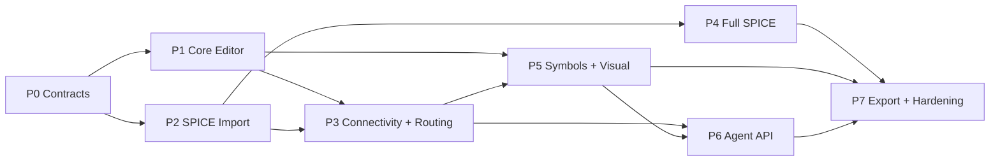

# Delivery Roadmap

The roadmap decomposes the accepted architecture into demonstrable phases.
Phases are ordered by dependency and exit gates, not by calendar estimates.

## Phase Index

| Phase | Plan | Status | Primary outcome |
|---:|---|---|---|
| 0 | [`Contracts and Scaffold`](phase-0-contracts-and-scaffold.md) | complete | Stable Project, Document, coordinate, Symbol, edit, and IR boundaries |
| 1 | [`Core Editor Slice`](phase-1-core-editor-slice.md) | complete | Manually place, move, save, reopen, and render a small schematic |
| 2 | [`SPICE Import`](phase-2-spice-import.md) | complete | Import current fixtures into Documents without losing connectivity |
| 3 | [`Connectivity and Routing`](phase-3-connectivity-and-routing.md) | complete | Wire, explicit junction, crossing, flightline, stretch, and detach closure |
| 4 | [`Full SPICE Baseline`](phase-4-full-spice-baseline.md) | complete | Complete SPICE3/ngspice structural compatibility and lossless round-trip |
| 5 | [`Symbols and Visual Quality`](phase-5-symbols-and-visual-quality.md) | complete | VSS-derived symbols and stable textbook-monochrome visual output |
| 6 | [`Agent API`](phase-6-agent-api.md) | complete | Safe `capabilities/query/transact/render` Agent integration |
| 7 | [`Export and Hardening`](phase-7-export-and-hardening.md) | proposed | Recovery, performance, broader dialects, and production export |

## Dependency Graph

Phase 1 and Phase 2 may proceed in parallel after Phase 0. Phase 4 may proceed
in parallel with the later part of Phase 5. A downstream phase must not assume
an upstream contract is stable until the upstream exit gate is recorded.

## Phase Rules

- Each phase must produce a user-visible or deterministically inspectable
  outcome, not only internal abstractions.
- A phase may create several bounded targets under `plan/`; the roadmap file
  is not a substitute for target ownership and dirty-state handling.
- New cross-module contracts require a spec or ADR before dependent targets
  implement against them.
- Exit gates require evidence in tests, golden fixtures, generated artifacts,
  or recorded review. Confidence alone is not an exit gate.
- Out-of-scope work remains visible; it is not silently pulled into a phase.

Use [`phase.template.md`](phase.template.md) when a new phase or a replacement
phase is introduced.
