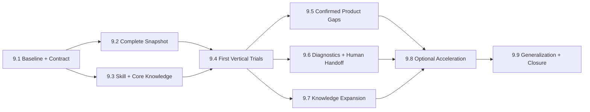

# Phase 9 - Snapshot-Driven Agent Workflow

Status: `implemented; external quality ablation retained as optional research`

## Objective

Establish a flat Agent workflow in which the host supplies one complete,
read-only Document Snapshot; a thin Skill governs the full lifecycle; on-demand
knowledge improves circuit understanding; typed transactions perform every
mutation; and render/diagnostics close the loop. Do this without a query
language, Layout Intent, mandatory topology classifier, or circuit-specific API.

## Frozen architecture decisions

This phase treats Agent reasoning as the semantic layout layer. The product
supplies complete facts and enforces legal edits; it does not prescribe how the
Agent must decompose, classify, or plan a circuit.

- The canonical reasoning input is one complete structured Document Snapshot,
  not a sequence of `summary/region/net/topology/changes` queries.
- The Project Index exists only to select and navigate Documents. Once selected,
  the Agent receives that Document's full electrical and presentation graph.
- Local focus, functional regions, pattern hypotheses, relative placement, and
  route planning are temporary Agent reasoning state. They are not API schemas,
  required files, or a persisted `LayoutIntent`.
- Runtime guidance has exactly two document layers: a thin governing Skill for
  the lifecycle and on-demand knowledge pages for circuit understanding and
  schematic expression.
- Program code owns topology fidelity, revision/lock/atomicity checks, symbol
  mapping, diagnostics, rendering, and generic typed edits. It may offer a
  measured optional helper, but never an authoritative semantic answer.
- API v2 is `capabilities/snapshot/transact/render`. API v1 `query` survives only
  as a compatibility surface and receives no new semantic/query-language work.

This ordering is deliberate: Snapshot and the first Skill/knowledge set are
built together, then real vertical trials identify product gaps. PDK, edit,
diagnostic, hierarchy, or helper expansion must be evidence from those trials,
not a prerequisite taxonomy designed before the Agent works.

## User-visible outcome

An Agent receives the complete electrical topology and current presentation of
the selected Document as structured JSON. It can understand the circuit using
pin-to-Net evidence, edit it through revision-safe transactions, inspect exact
diagnostics and rendered output, refresh after concurrent human changes, and
hand a valid readable schematic back to the user.

A small circuit needs no context-planning calls. A hierarchical or 100+
transistor circuit starts from a small Project Index and then one complete
Snapshot per selected Document. A human can navigate the same Documents, inspect
the same diagnostics, lock accepted work, and continue in the GUI.

## In scope

- A versioned `AgentSessionSnapshot`/`AgentDocumentSnapshot` contract.
- Complete, bidirectional pin-to-Net and Net-to-terminal mappings.
- Full relevant presentation state: placements, Routes, Junctions, labels,
  groups, constraints, locks, bounds, and diagnostics.
- A Project Index containing Document nodes and instance-reference edges.
- A flat `capabilities/snapshot/transact/render` Agent-facing workflow.
- Compatibility handling for the accepted v1 `query` API without extending it
  into `select/expand/include`.
- A thin `circuit-layout` Skill that governs the complete Agent lifecycle.
- A separate, progressively loaded circuit knowledge library.
- PDK symbol normalization and the missing generic symbol/port edit operations.
- Spatial, object-addressed diagnostics and human hierarchy/review affordances.
- Early baseline/vertical trials, A/B evaluation, and generalization fixtures.
- Optional helpers only after measured evidence shows a remaining mechanical
  bottleneck.

## Out of scope

- Raw Project/Document replacement through the Agent API.
- Persisting Snapshot as a required project file.
- A general query DSL or mandatory region/topology query sequence.
- A product-level `LayoutIntent`, `Layout Compiler`, or `packages/layout`.
- Authoritative automatic circuit classification.
- Circuit-specific endpoints such as `draw_cdac`.
- Fully automatic optimal placement/routing guarantees.
- Loading the complete knowledge library into every Agent task.
- Electrical simulation or analog performance claims.

## Dependencies

- Completed [`Phase 8`](phase-8-direct-manipulation-and-manual-authoring.md)
  authoring baseline.
- Accepted [`Agent API`](../specs/agent-api.md),
  [`Edit Engine`](../specs/edit-engine.md),
  [`Schematic Model`](../specs/schematic-model.md),
  [`Connectivity and Routing`](../specs/connectivity-and-routing.md),
  [`Symbol DSL`](../specs/symbol-dsl.md), and
  [`Project File Format`](../specs/project-file-format.md), revised through an
  ADR/version change where Phase 9 is incompatible.
- Accepted
  [`Snapshot-Driven Agent Architecture`](../agent/rule-guided-layout-architecture.md)
  and
  [`Agent Skill and Knowledge Plan`](../agent/knowledge-and-skill-plan.md).
- Existing RLC, SKY130 CDAC, hierarchy, dense analog, symbol, and performance
  fixtures plus one reviewed unseen non-regular large circuit.

## Dependency shape



WP-9.5 and WP-9.6 contract work may begin after WP-9.1 where gaps are already
known, but their final scope and exit evidence must incorporate WP-9.4 traces.

## Work packages

### WP-9.1 - Record baseline and freeze the Snapshot/Skill contract

- Goal: measure the current Agent workflow before adding guidance, then freeze
  the one-Snapshot input, Skill responsibilities, compatibility path, metrics,
  and non-regression gates.
- Main modules: ADR/specs, current Agent adapter, trace harness, RLC/CDAC/unseen
  fixtures, Skill skeleton, and evaluation rubric.
- Required decisions: Snapshot versus raw `.icproj`; Project Index boundary;
  v1 query compatibility versus API v2; source permissions; ordering/hash;
  payload/context budgets; refresh behavior; primary A/B metrics.
- Validation surface: current no-Skill traces with query/edit/render counts,
  rollback/error counts, token/elapsed cost, electrical outcome, diagnostics,
  and blinded readability review.

### WP-9.2 - Implement the complete read-only Snapshot

- Goal: provide every fact needed for circuit understanding and current drawing
  edits in one deterministic Document JSON view.
- Main modules: model projection, Agent adapter, generated schemas/types,
  Project Index, Snapshot version/hash, permissions, size accounting, and SDK/
  host injection.
- Required content: ports; instances with name/symbol/model/parameters,
  placement, and pins; Nets with terminals/ports; complete Routes; Junctions;
  annotations; groups/constraints/locks with members; bounds; status; and
  diagnostics.
- Validation surface: instance-pin/Net-terminal bidirectional consistency,
  stable ordering/hash, Project reference edges, source permission filtering,
  100/500-instance payload measurements, round-trip prohibition, and canonical
  generation from a validated Document.
- Compatibility: retain v1 query behavior in an adapter, but do not add the
  previously proposed generic selector/expansion language.

### WP-9.3 - Build the thin Skill and core knowledge

- Goal: make the Skill govern the workflow from Snapshot intake through final
  handoff while loading circuit knowledge only when useful.
- Main modules: `skills/circuit-layout/SKILL.md`, reference manifest,
  `docs/agent/knowledge/`, compatibility metadata, and documentation checks.
- Initial knowledge: circuit reading, schematic expression, routing/diagnostics,
  plus differential-pair, current-mirror, and arrays/ladders cards.
- Required behavior: Snapshot/revision validation, Document choice, knowledge
  routing, evidence-first reasoning, typed-edit batching, dry-run, render/
  diagnostic repair, stale/lock/limit recovery, refresh, and completion gates.
- Validation surface: optional helpers disabled; small and large paths;
  missing-capability variants; rule owner/strength audit; positive and
  counterexamples; and no fixed internal planning schema.

WP-9.2 and WP-9.3 proceed in parallel after their shared contract is frozen.

### WP-9.4 - Run the first Snapshot-driven vertical trials

- Goal: use the real Snapshot and Skill to distinguish missing facts, missing
  knowledge, missing actions, and repeated mechanical work before expanding
  the product or knowledge taxonomy.
- Main modules: trace runner, RLC, hierarchical CDAC, one unseen analog circuit,
  visual review sheets, metrics, and issue classification.
- Required flow: Snapshot -> knowledge routing -> Agent reasoning -> typed
  transactions -> render/diagnostics -> refresh -> global review.
- Validation surface: compare with WP-9.1 baseline; record every failure's
  owning layer; prove no region/topology query is required; retain failed traces
  rather than only successful output.

### WP-9.5 - Close confirmed PDK and editing gaps

- Goal: remove already observed deterministic obstacles and any additional
  product gaps demonstrated by WP-9.4, without moving semantic judgment into
  the product.
- Main modules: PDK symbol registry, import normalization, model, Edit Engine,
  Agent adapter, and palette/inspector parity.
- Confirmed operations: `set_instance_symbol`, `place_port`, `move_port`, and
  complete generic Route/Junction/text/constraint/lock edits where existing
  operations cannot express the required human action.
- PDK rules: explicit override, exact model/subckt, PDK-scoped mapping,
  primitive fallback, generic unresolved symbol; always preserve original model
  and parameters and never guess pin order/bulk.
- Validation surface: SKY130 nfet/pfet, unknown model, conflicting pin map,
  undo/redo, stale revision, locks, atomic rejection, and GUI/Agent parity.

### WP-9.6 - Make feedback and human handoff actionable

- Goal: give Agent and human the same precise problem locations and a smooth
  Document-level review/handoff path.
- Main modules: derived diagnostics, renderer, Agent Snapshot/transaction
  responses, editor diagnostic selection, hierarchy navigation, notifications,
  constraints, and locks.
- Required diagnostics: stable code/severity, revision, object ids, bounds/
  point, typed parameters, and deterministic repair candidate where one exists.
- Required editor behavior: enter hierarchy instance, return parent/top, switch
  Document, show shared reference context, jump to diagnostic, notify about
  Agent changes outside the current Document, and protect accepted regions.
- Validation surface: overlaps, crossing, dangling endpoints, unresolved
  symbols, out-of-bounds geometry, stale diagnostics, shared-child navigation,
  viewport restoration, lock rejection, and Playwright handoff flows.

### WP-9.7 - Expand knowledge from observed reasoning failures

- Goal: add knowledge only where multiple circuits show a repeated
  understanding or expression problem.
- Main modules: hierarchy/large-circuit, PDK/symbol, human-collaboration docs;
  cascode/stacks, switching/sampling, feedback/path cards; examples and failure
  recoveries.
- Required method: each rule identifies owner/strength/trigger; each card has
  connection/parameter evidence, counterevidence, variants, expression goals,
  failure modes, and positive/negative examples.
- Validation surface: renamed/shuffled/asymmetric variants and evidence review;
  one-off cases remain examples instead of immediately becoming rules.

### WP-9.8 - Add only measured optional acceleration

- Goal: reduce a bottleneck that remains after complete Snapshot, Skill,
  knowledge, generic edits, and diagnostics are working.
- Entry gate: WP-9.4/9.7 traces quantify repeated cost and predeclare the target
  improvement; without this evidence, this package delivers no new helper.
- Candidate modules: pure derived topology/path candidates or SDK/Edit Engine
  array, spacing, mirror, and route generators.
- Required behavior: evidence/conflicts/version output, no mutation, optional
  use, generic typed-edit expansion, and a complete disabled-helper path.
- Validation surface: false positives, direct-edit equivalence, context/time/
  transaction savings, and no change to electrical or lock invariants.

### WP-9.9 - Prove generalization and close the phase

- Goal: prove that Snapshot + Skill + knowledge works beyond fixture names,
  known ordering, and the circuits used to write the initial cards.
- Main modules: fixture transformations, a reviewed unseen 100+ transistor
  circuit, traces, performance reports, visual review, Skill package/version,
  and phase evidence.
- Validation surface: renaming, ordering shuffle, equivalent SPICE encodings,
  deliberate asymmetry, unknown PDK, flat/hierarchical forms, optional helpers
  disabled, and four-level Skill/knowledge ablation.

## Deliverables

- Accepted Snapshot/API/compatibility ADR and schemas.
- Deterministic Project Index and complete AgentDocumentSnapshot generator.
- Thin versioned `circuit-layout` Skill and on-demand knowledge library.
- Baseline, first vertical, failure, recovery, A/B, and ablation traces.
- Reproducible external four-tier kit with hashed isolated contexts, strict
  result validation, anonymous render mapping, and score aggregation.
- Reviewed PDK mapping baseline and missing typed edits.
- Spatial diagnostics and editor hierarchy/handoff behavior.
- Only optional helpers that pass the WP-9.8 entry gate.
- Generalization fixtures and 100+ transistor performance/visual evidence.
- Updated Agent/user documentation.

## Acceptance scenarios

```text
Small RLC Document
-> host supplies capabilities, Project Index, and one complete Snapshot
-> Agent reads all pin-Net facts without a query plan
-> Skill guides typed edits and render/diagnostic repair
-> result is saved through the existing Project path
```

```text
Hierarchical SKY130 CDAC
-> Project Index exposes Document nodes and reference edges
-> Agent selects a child and receives its complete Snapshot
-> reviewed PDK mappings resolve known MOS devices
-> no CDAC endpoint, topology classifier, or Layout Intent is used
```

```text
Non-regular 100+ transistor Document
-> complete Snapshot fits the measured host/context budget
-> Agent internally focuses on local structures while retaining global facts
-> transactions remain local and revision-safe
-> a refreshed complete Snapshot supports final global review
```

```text
Human edits the Document after the Agent receives revision 42
-> old transaction returns STALE_REVISION
-> Agent refreshes the complete Snapshot at revision 43
-> Agent re-evaluates instead of blindly replaying the old edits
```

```text
Unknown model or ambiguous pin order
-> Snapshot preserves original model, parameters, and imported connectivity
-> Skill forbids guessing
-> Agent keeps a generic symbol or requests a reviewed mapping
```

```text
Locked human layout and two overlapping labels
-> Snapshot and diagnostics identify locks, object ids, and overlap bounds
-> Agent repairs only the movable label
-> any transaction touching locked objects rejects atomically
```

```text
Same circuit is renamed, reordered, and made partly asymmetric
-> Agent bases understanding on pin-Net/parameter evidence
-> counterevidence prevents forced pattern classification
-> optional helpers disabled does not block completion
```

## Deterministic validation

- Snapshot schema/type generation, version compatibility, stable ordering/hash,
  and bidirectional topology consistency.
- Assertion that Snapshot is read-only and cannot enter a whole-Document write
  path.
- Project Index hierarchy/reference and Document-switch tests.
- Payload bytes, serialized tokens, generation time, and host injection for
  100/500-instance and selected 100+ transistor fixtures.
- Typed edit atomicity, revision, lock, undo/redo, permissions, dry-run, and
  GUI/Agent parity.
- Spatial diagnostic location, revision invalidation, and bounded/full render
  tests.
- Skill compatibility, missing-capability, progressive-loading, broken-link,
  rule-owner, and package-completeness checks.
- Baseline and four-level ablation: no Skill; thin Skill; Skill + core knowledge;
  Skill + full on-demand knowledge.
- External-kit negative tests: incomplete evidence, changed electrical facts,
  changed locks, modified tier inputs, mismatched model/settings, query/helper
  use, and a Snapshot inconsistent with the final Project cannot reach review.
- Hard non-regression: zero electrical errors, lock violations, and silent Net
  changes.
- Primary non-regression: unseen-circuit completion rate and blinded readability
  do not decline.
- Predeclared efficiency measures: refresh/transaction/rollback count, context
  tokens, or elapsed time; improvements cannot hide severe degradation elsewhere.
- Renamed/shuffled/asymmetric/unknown-PDK/generalization tests and full Phase 8
  regression gates.

## Risks and decisions

| Risk or decision                                     | Handling                                                                                                    |
| ---------------------------------------------------- | ----------------------------------------------------------------------------------------------------------- |
| Snapshot is confused with writable Project JSON      | Use a separate schema/version, derived-only generator, and no whole-Snapshot mutation endpoint.             |
| Complete Snapshot exceeds context limits             | Measure first; omit source/SVG/cache; use deterministic transport chunks only after a documented threshold. |
| Duplicate pin/Net indexes disagree                   | Generate both from one validated model and assert bidirectional consistency/hash deterministically.         |
| v1 clients depend on query scopes                    | Preserve a compatibility adapter and freeze the v2 or additive migration in WP-9.1.                         |
| Skill becomes a hidden Layout Intent                 | Keep it action-oriented and never require an internal planning representation.                              |
| Knowledge becomes a second hard-truth source         | Assign owner/strength; link specs for electrical/API truth; move deterministic checks into validators.      |
| Skill and knowledge arrive too late to shape the API | Build WP-9.2 and WP-9.3 in parallel and require WP-9.4 before broad product/helper expansion.               |
| Optional helpers become an early abstraction project | Enforce the WP-9.8 measured entry gate and disabled-helper acceptance path.                                 |
| Pattern cards overfit fixture names                  | Require connection evidence, counterexamples, renaming/reordering/asymmetry tests, and an unseen circuit.   |
| A single improved metric masks overall regression    | Freeze hard, primary, and efficiency metrics before trials and report the complete scorecard.               |

## Exit gate

- [x] Snapshot/API/Skill contracts and compatibility decision are accepted.
- [x] All seven acceptance scenarios have reproducible Snapshots, transactions,
      renders, diagnostics, and traces.
- [x] RLC and CDAC complete without a query language, Layout Intent, or optional
      helper dependency.
- [x] The selected 100+ transistor Document has recorded payload/context/generation
      budgets and completes with a final refreshed Snapshot review.
- [x] Snapshot topology is complete and bidirectionally consistent; unknown mappings
      remain visible and safe.
- [x] GUI and Agent preserve the same electrical, revision, lock, and atomicity
      invariants.
- [x] A post-knowledge-freeze hierarchical 4-bit Flash ADC is pinned as the
      common held-out input, with deterministic import, corpus connectivity,
      Snapshot size/hash, and isolated-kit preparation evidence.
- [x] The optional external Agent evaluation path is implemented and self-tested.
      Two real four-level runs preserved the hard electrical boundary but did not
      show stable visual non-regression across guidance tiers. This is recorded as
      product evidence: Skill/knowledge remain optional Agent guidance and are not
      a runtime or Phase-exit dependency.
- [x] The deterministic four-level package ablation meets its hard gates and the
      targeted progressive-loading context target without severe degradation.
- [x] Failed external quality hypotheses are recorded without promoting new API
      structure or forcing Agent reasoning into a layout schema. Further model
      comparison is a research benchmark, not a product acceptance gate.
- [x] Optional helpers either pass their measured entry/benefit gate or remain
      absent; disabling them always leaves the core flow complete.
- [x] Phase evidence records known limitations, compatibility range, enabled helper
      inventory, human visual review, and deferred decisions before status changes
      from `proposed`.
