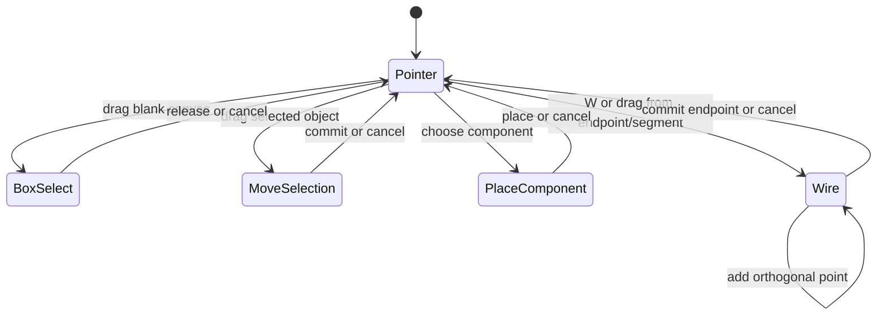

# Editor Interaction Contract

Status: `accepted`

Version: `1.0`

Owning phase: `Phase 8`

Primary owner: `apps/editor`

## Purpose

Define the target human interaction model for a compact schematic editor. The
canvas uses direct manipulation and context instead of exposing every internal
Edit Engine operation as a permanent toolbar button. Human UI operations and
Agent API transactions must still resolve to the same typed, atomic edits.

Phase 8 implements this contract as a compatible extension of the Phase 7
Project and Document baseline.

## Consumers

- The editor shell, canvas controller, component palette, and context menus.
- The Edit Engine and history implementation.
- Connectivity, routing, derived-overlay, and SVG-rendering modules.
- The built-in Symbol DSL library and VSS development-import workflow.
- The Agent adapter and its capability/schema artifacts.
- Keyboard, pointer, integration, and visual-regression tests.

## Terminology

| Term              | Meaning                                                                                                                |
| ----------------- | ---------------------------------------------------------------------------------------------------------------------- |
| Pointer mode      | Default canvas state in which click, drag, selection, and contextual handles infer the immediate interaction.          |
| Wire session      | A cancellable interaction from a pin, route segment, junction, or explicit Wire command to a valid endpoint.           |
| Snap candidate    | Transient preview of the exact pin, segment, junction, or grid point that would receive the next action.               |
| Crossing          | A geometric route intersection with no electrical connectivity and no persisted junction.                              |
| Junction          | A persisted electrical connection displayed as a dot where a wire explicitly starts, ends, or branches on a conductor. |
| Atomic move       | One transaction that moves all selected objects and applies all required local route stretch, or changes nothing.      |
| Contextual action | An action shown only when the current selection can use it, such as alignment for multiple selected instances.         |

## Command surface

The production header should expose only frequent entry points:

```text
+ Component | Wire | File | Edit | View | Export | More
```

The exact visual treatment may use icons, labels, or responsive grouping, but
the information architecture is normative:

| Group  | Commands                                                             |
| ------ | -------------------------------------------------------------------- |
| File   | Open, Save, Import, recent/example documents                         |
| Edit   | Undo, Redo, Delete, and contextual Align                             |
| Add    | Component in the header; Text in More                                |
| View   | Fit, Diagnostics, Grid, and presentation overlays                    |
| Export | SVG, PNG, and PDF from one menu                                      |
| More   | Help, shortcut reference, and development-only examples when enabled |

The following are not permanent production toolbar modes:

- Select, Junction, Crossing, Stretch, Detach, Rotate, Mirror, Zoom, and Pan.
- Save snapshot and Reopen snapshot; recovery is automatic infrastructure.
- Phase/demo actions; examples belong in File/Open Example or development mode.

Wire remains visible for discoverability, while pointer-down on a pin or a
selected conductor starts the same wire session.

## Keyboard contract

| Input                      | Action                                                                             |
| -------------------------- | ---------------------------------------------------------------------------------- |
| `R`                        | Rotate the selected placeable objects by 90 degrees.                               |
| `W`                        | Enter or continue Wire mode.                                                       |
| `Escape`                   | Cancel the active gesture, then return to Pointer mode.                            |
| `Delete` / `Backspace`     | Delete the selected object after applying the selection-specific semantic command. |
| `Ctrl+Z`                   | Undo one committed transaction.                                                    |
| `Ctrl+Y` or `Ctrl+Shift+Z` | Redo one transaction.                                                              |
| `Ctrl+S`                   | Save the current Project.                                                          |
| `Ctrl+O`                   | Open a Project.                                                                    |
| `Ctrl+A`                   | Select all selectable objects in the active Document.                              |
| `F`                        | Fit the active Document in the viewport.                                           |

Letter and editing shortcuts must not fire while focus is in a text input,
text editor, searchable palette field, or another control that consumes the
key. Browser-reserved shortcuts must not be intercepted unless the application
can complete the named operation safely.

## Pointer and viewport contract

### Default selection

- Clicking a selectable object selects it; clicking blank canvas clears the
  selection.
- `Shift`-click or `Ctrl`-click adds or removes an object from the selection.
- Dragging blank canvas creates a rectangular selection preview. Releasing
  commits the selection; `Escape` restores the prior selection.
- Dragging any selected movable object moves the whole movable selection in
  one atomic transaction.
- An atomic multi-object move includes owned annotations and deterministic
  local route stretch. If any member is locked or violates a constraint, the
  whole move is rejected with a visible reason.

### Viewport

- `Ctrl` plus mouse wheel zooms around the cursor position.
- Middle-button drag pans the viewport.
- Viewport changes never modify the Document revision or enter undo history.
- Normal wheel behavior remains available to the host page when the canvas
  does not own focus or the zoom modifier is absent.

### Contextual manipulation

- A selected direct route segment exposes a drag handle that creates an
  orthogonal dogleg; there is no separate Stretch tool. Additional elbow
  handle forms are a compatible later extension.
- Rotate and Mirror are available from shortcuts or a contextual selection
  control.
- Alignment appears only for a compatible multi-selection.
- Route or endpoint removal uses distinct context commands: `Remove route
geometry`, `Disconnect endpoint`, and `Delete connection`. These operations
  must not be represented by one ambiguous Detach command.

## Manual component authoring

The Add Component entry opens a searchable palette grouped by device family.
Choosing a symbol starts single-shot placement and the next canvas click places
an instance. Placement is possible in a new empty Document without importing
SPICE first.

Phase 8 requires typed Edit Engine operations equivalent to:

```ts
add_instance;
remove_instance;
connect_endpoints;
merge_nets;
disconnect_endpoint;
```

The accepted Edit Engine revision defines these names and payloads. GUI
operations and Agent transactions call those same semantic operations; neither
surface patches Project JSON directly.

For an imported source, any manual edit that changes electrical connectivity
sets the active Document's `sourceStatus` to `connectivity-modified`. The
original source and source manifest remain preserved. Phase 8 does not write
modified connectivity back to SPICE text.

## Wire, junction, and crossing behavior

The core rule is:

> Passing across a conductor is a Crossing; ending or starting on a conductor
> is a Junction.

### Starting and ending

- Starting from a pin or existing junction opens a wire session from that
  endpoint. Free-standing wire endpoints are deferred.
- Starting from the interior of an existing route segment previews and, on
  commit, creates or reuses a junction atomically.
- Releasing on a pin or existing junction connects to it.
- Releasing on the interior of a route segment previews a dot and, on commit,
  splits the route as needed and creates or reuses a junction atomically.
- Passing over or crossing a route without ending there creates no junction,
  no dot, and no connectivity.
- A wire end that geometrically hits more than one route segment is rejected as
  ambiguous. The user must choose one conductor away from the crossing.

### Net semantics

| Endpoint state                 | Committed result                                                    |
| ------------------------------ | ------------------------------------------------------------------- |
| Both endpoints unconnected     | Create one new Net and route.                                       |
| One endpoint connected         | Attach the other endpoint to that Net.                              |
| Endpoints on different Nets    | Explicit wire completion merges the Nets atomically after preview.  |
| Both endpoints on the same Net | Add or adjust route geometry without changing logical connectivity. |

`Alt` temporarily suppresses snapping. `Escape` or secondary-click cancels the
uncommitted wire session. Undo restores the complete pre-transaction topology,
route geometry, source status, and revision-visible state.

## Automation boundary

The editor may automate low-risk geometry and interaction consequences:

- snap preview, grid quantization, junction reuse, route splitting, local
  stretch, contextual handles, selection inference, and derived crossings;
- viewport navigation and visual overlays that do not change the Document.

The editor must keep ambiguous or destructive logical intent explicit:

- disconnecting endpoints, deleting connections, merging Nets other than by
  an explicitly completed wire, source writeback, and resolving an ambiguous
  multi-conductor connection.

All inferred edits require a deterministic preview when they would change
connectivity.

## Symbol fidelity boundary

The component palette uses runtime-independent Symbol DSL definitions. The 12
review-manifest families retain their VSS evidence and human-reviewed pin
mappings. Phase 8 also adds project-native VDD and VSS power-port definitions;
these do not claim an additional VSS pin review.

The first fidelity set is NMOS/PMOS, NPN/PNP, resistor, capacitor, inductor,
diode, voltage/current sources, VDD/VSS/GND, and ports. VSS remains immutable
build-time evidence; the runtime must not require Visio or parse `.vss` files.

## Interaction state transitions



Only a completed placement, move, semantic edit, or wire session increments the
Document revision. Previews and cancelled gestures are transient.

## Persistence boundary

- Persisted: committed instances, annotations, logical Nets, endpoints,
  junctions, route geometry, source status, and user-facing presentation state
  already covered by the Project and Document specifications.
- Session-local: current selection, open menu, palette query, active gesture,
  snap candidate, drag rectangle, context handles, and viewport transform.
- Derived: crossings, flightlines, diagnostics, hover affordances, and snap
  overlays.
- External build-time evidence: VSS inventories, reviewed pin mapping, and
  geometry comparison artifacts.

## Valid example

```text
Empty Document
-> add an NMOS and resistor from the component palette
-> drag from the NMOS drain to the resistor pin
-> pass over one unrelated route and release on a second route
-> the passed route remains an unconnected Crossing
-> the release route displays a Junction dot and joins the resulting Net
-> one Undo restores the exact topology and geometry before the wire commit
```

## Rejected example

```text
The pointer merely moves across two intersecting route segments
-> the editor silently creates a Junction and merges their Nets
```

Required result: reject this behavior. A geometric crossing is derived and
non-electrical unless an explicit wire start/end gesture commits connectivity.

## Compatibility and migration

- Existing Phase 7 Projects remain valid; no file-format migration is required
  merely to adopt the new interaction controller.
- New topology operations are additive revisions of the Edit Engine, Agent
  capability schema, and connectivity specification.
- The Phase 7 explicit Junction command is absent from the production toolbar.
- Shortcut mappings must be discoverable and configurable in a later version;
  Phase 8 freezes only the default mapping.

## Deterministic validation

- Unit tests for the interaction state machine, shortcut focus guards, cursor-
  centered zoom math, rectangle selection, and atomic multi-object movement.
- Edit Engine parity tests proving GUI and Agent operations produce identical
  Documents for instance and topology edits.
- Connectivity tests for every endpoint-state row, route splitting, junction
  reuse, crossing non-connectivity, multi-conductor previews, cancel, and undo.
- Playwright pointer and keyboard flows for empty-Document authoring,
  multi-selection, middle-button pan, zoom, direct wiring, and contextual
  deletion.
- Reviewed VSS-to-Symbol-DSL comparison artifacts and stable symbol preview
  goldens for the 12-family review-manifest set, plus unit previews for the
  project-native VDD/VSS power ports.
- Production-build inspection proving demo controls are hidden and runtime code
  does not depend on Visio or `.vss` parsing.

## Open decisions

- User-remappable shortcut persistence and free-standing wire endpoints remain
  compatible post-Phase-8 extensions.
- General elbow/segment handles beyond the accepted direct-segment dogleg
  interaction remain deferred.
