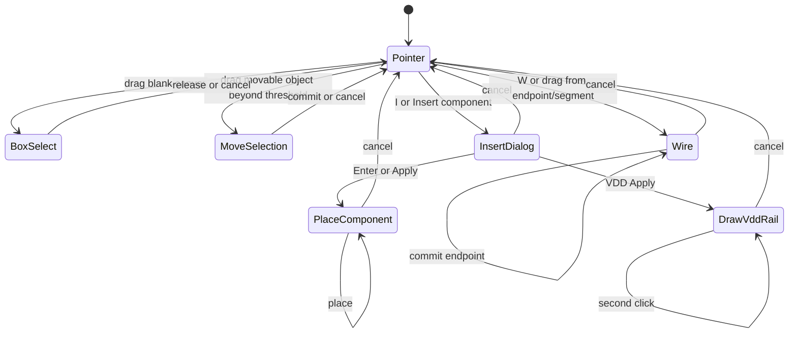

# Editor Interaction Contract

Status: `accepted`

Version: `1.9`

Owning phase: `Phase 8`

Primary owner: `apps/editor`

Related ADRs: [`0013-project-connectivity-index.md`](../adr/0013-project-connectivity-index.md),
[`0015-object-locator-and-diagnostic-envelope.md`](../adr/0015-object-locator-and-diagnostic-envelope.md).
Project search and net highlight/trace (WP-R5/R6) navigate via `ObjectLocator` +
`navigateTo` and read the unified connectivity index; navigation never mutates a
revision or clears an undo history.

## Purpose

Define the target human interaction model for a compact schematic editor. The
canvas uses direct manipulation and context instead of exposing every internal
Edit Engine operation as a permanent toolbar button. Human UI operations and
Agent API transactions must still resolve to the same typed, atomic edits.

Phase 8 implements this contract as a compatible extension of the Phase 7
Project and Document baseline.

## Consumers

- The editor shell, canvas controller, component insertion dialog, and context
  menus.
- The Edit Engine and history implementation.
- Connectivity, routing, derived-overlay, and SVG-rendering modules.
- The built-in Symbol DSL library and VSS development-import workflow.
- The Agent adapter and its capability/schema artifacts.
- Keyboard, pointer, integration, and visual-regression tests.

## Terminology

| Term              | Meaning                                                                                                                |
| ----------------- | ---------------------------------------------------------------------------------------------------------------------- |
| Pointer mode      | Default canvas state in which click, drag, selection, and contextual handles infer the immediate interaction.          |
| Wire session      | A cancellable interaction from a pin, route segment, junction, or explicit Wire command to a valid endpoint.           |
| Snap candidate    | Transient preview of the exact pin, segment, junction, or grid point that would receive the next action.               |
| Crossing          | A geometric route intersection with no electrical connectivity and no persisted junction.                              |
| Junction          | A persisted electrical connection displayed as a dot where a wire explicitly starts, ends, or branches on a conductor. |
| Atomic move       | One transaction that moves all selected objects and applies all required local route stretch, or changes nothing.      |
| Contextual action | An action shown only when the current selection can use it, such as alignment for multiple selected instances.         |

## Command surface

The production header exposes document/navigation and high-frequency document
commands. Component placement uses a compact quick-place Library for starter
and recent devices plus the existing master/detail insertion dialog for the
full catalog and parameters. Drawing tools remain in the `Draw` menu:

```text
Library | File | Edit | Draw
```

The exact visual treatment may use icons, labels, or responsive grouping, but
the information architecture is normative:

| Group   | Commands                                                              |
| ------- | --------------------------------------------------------------------- |
| File    | Open, Save, recovery-safe Refresh app, Import, and Export             |
| Edit    | Undo, Redo, Delete, Clear canvas, and contextual Align                |
| Draw    | Insert Component; Wire, Text, Arrow, Construction line, and Rectangle |
| Library | Toggle starter/recent quick-place chips; open the full Insert dialog  |

The following are not permanent production toolbar modes:

- Select, Junction, Crossing, Stretch, Detach, Rotate, Mirror, Zoom, and Pan.
- Save snapshot and Reopen snapshot; recovery is automatic infrastructure.
- Phase/demo actions; examples belong in File/Open Example or development mode.

`I`, `Draw > Insert component`, or the Library's Insert entry opens one stable
two-column dialog. Its left
setup column contains one compact searchable component picker, device-specific
parameters, and one compact placement row for initial rotation plus an optional
label/name; the
categorised list is collapsed by default and expands only inside that picker.
The right column always shows the currently selected symbol's full preview at
the selected initial rotation. Arrow keys move the current option, `R` rotates
the preview by 90 degrees when focus is outside text-entry controls, and
`Enter` or `Apply` starts persistent placement. Each canvas click commits one
independent component and keeps the same placement request active; `Escape`
cancels the dialog or exits placement. During placement the resolved symbol
follows the pointer and `R` updates its rotation before the next placement
click. Recent symbols
are promoted inside their existing category and in the Library's bounded Recent
section. Quick-place starts with blank parameter values; displayed placeholders
remain hints rather than persisted electrical values. The dialog and Library
reuse the Symbol DSL renderer and own no separate thumbnail assets.

The editor shell is viewport-contained: the document body never becomes the
scroll owner, overlays and inspectors scroll internally, and the SVG canvas
fills the remaining application row. A low-interference bottom-right control
shows zoom percentage, zoom in/out, and Fit View. Empty Documents show a subtle
`I`/`W` quick-start hint that disappears after authored content exists. Draw,
rotate, lock, and viewport actions use one linear SVG icon vocabulary while
retaining text and shortcut labels. Hover, selected, active-tool, placement
ghost, endpoint snap, and transient alignment feedback remain editor overlays and never
enter formal export.

Fit and zoom are direct canvas controls and shortcuts, so a second `View` menu
must not duplicate them. Formal SVG/PNG/PDF export remains grouped in `File`.

## Text and peripheral editing

This section is `proposed` (ADR 0010); interaction lands in WP-A3/A4. It
freezes the V1 tool surface and command mapping.

The `Draw` menu owns Text and free drawing tools. Route-attached annotations
remain contextual rather than permanent toolbar modes:

| Group   | Contents                                                                     | Shortcut                 |
| ------- | ---------------------------------------------------------------------------- | ------------------------ |
| Text    | text, caption, format tools                                                  | `T` text placement       |
| Markup  | free arrow, construction line, and rectangle; route arrow remains contextual | `A` arrow, `R` rectangle |
| Palette | search all low-frequency commands                                            | `Ctrl+K`                 |

`R` is context-dispatched on the unified canvas: it rotates a selected placed
component, arrow, construction line, or rectangle by +90 degrees; when there is
no rotatable selection it follows Virtuoso Layout by entering Rectangle mode.
`Shift+R` mirrors a selected object or group left/right; `Shift+V` mirrors it
top/bottom. `W`, undo/redo, and the rest of the keyboard contract are unchanged.
Canvas shortcuts must not fire
while a rich-text editor, input, or search field has focus.

Rich text is edited in place: selecting `Text` and clicking canvas/Route/object
shows a free/route/object anchor preview, then an inline editor. `Enter` breaks
the line, `Ctrl+Enter` commits, `Escape` cancels or exits. A floating format
bar is placed completely above or below its target when space allows. Its
opaque frame owns pointer and wheel input across its complete bounds, so
editing cannot select, move, or draw on underlying canvas objects. The bar acts
on the selection with italic, bold, subscript, and superscript buttons;
`Ctrl+I` and `Ctrl+B` are keyboard aliases. Font size uses bounded +/- levels,
never an unbounded numeric field. Formatting is persisted directly as the
canonical RichText AST. Text that resembles former markup commands, including
`M_{1}` and `\frac{a}{b}`, remains literal when entered in this editor.
Historical plain-text annotations are converted by Project migration; current
editor interaction never renders or edits a string fallback.

Route markers, arrows, leaders, and callouts use the shared `VisualAnchor`: a
current marker dragged along a Route updates `segmentIndex/t`, a normal drag
updates a bounded `normalOffset`, and a reverse button toggles `direction`.
The route marker uses the same precise dashed selection rectangle as component
and text selection; separate closer/away movement buttons are not exposed. A leader/
callout is first pointed at the explained object/node, then dragged to the
explanation; its text and leader select, move, copy, and delete as one object.
A Route geometry edit must preserve a marker's physical position and segment
direction when segment indices change. Splitting a Route at a Junction remaps
the marker to the nearest resulting Route; it must never leave a marker
referencing the replaced Route id. Route markers and internal Junctions are
members of the same live group preview as their selected circuit subgraph.
A construction line is visually distinct from Wire (dashed/lighter preview) and
never shows an electrical snap/junction preview.
A rectangle is a persisted, non-electrical outline with four resize handles;
its line style, stroke width, bearing, lock, movement, and deletion use the same
drafting controls as free arrows and construction lines.

One permanent, editor-owned Snap Engine resolves every pointer profile. It
prioritizes exact compatible electrical endpoints, Route geometry, peer object
centers/edges, drafting anchors, and finally the grid. X and Y matches are
independent so pin, center, and edge extension lines can align without forcing
objects to overlap. Profiles decide which candidates are legal: Wire may create
electrical connectivity after snap, while object and drafting profiles only
change geometry. Instance candidates that would move the primary instance off
the document grid are discarded before preview. Holding `Alt` after a drag has
latched temporarily suppresses Snap and permits an unconstrained translation.
Copy/paste uses fresh IDs and remaps internal object/route anchors in
the same Document; external target anchors become free anchors with a prompt.

Hit testing uses a screen-pixel tolerance, not a large document-coordinate
circle. The canvas resolves one semantic candidate list at pointer-down rather
than allowing SVG paint order to choose an event owner. Explicit handles rank
first; an already-selected object is sticky across overlapping text, symbols,
Routes, and drawing geometry. `Alt` chooses the next candidate at the same
point, so an attached label remains reachable without allowing it to steal a
component or short Route drag.

## Keyboard contract

| Input                      | Action                                                                             |
| -------------------------- | ---------------------------------------------------------------------------------- |
| `R`                        | Rotate a rotatable selection +90°; otherwise enter Rectangle mode.                 |
| `Shift+R`                  | Mirror selected objects left/right.                                                |
| `Shift+V`                  | Mirror selected objects top/bottom.                                                |
| `F`                        | Fit the active Document in the viewport.                                           |
| `W`                        | Enter Wire mode; every completed Route resets its source and keeps Wire active.    |
| `L`                        | Edit/create the selected Route's electrical Net Label.                             |
| `K`                        | Enter Construction line mode.                                                      |
| `Q`                        | Open Properties for the selected object and focus its primary editor.              |
| `Escape`                   | Cancel the active gesture, then return to Pointer mode.                            |
| `Delete` / `Backspace`     | Delete the selected object after applying the selection-specific semantic command. |
| `U` / `Shift+U`            | Undo / redo one committed transaction.                                             |
| `Ctrl+Z`                   | Undo one committed transaction (browser-compatible alias).                         |
| `Ctrl+Y` or `Ctrl+Shift+Z` | Redo one transaction (browser-compatible aliases).                                 |
| `Ctrl+S`                   | Save the current Project.                                                          |
| `Ctrl+O`                   | Open a Project.                                                                    |
| `Ctrl+A`                   | Select all selectable objects in the active Document.                              |
| `C`                        | Start persistent copy placement of the selected routed subgraph until `Escape`.    |
| `Home`                     | Fit the active Document in the viewport (compatible alias).                        |

Letter and editing shortcuts must not fire while focus is in a text input,
text editor, searchable palette field, or another control that consumes the
key. Browser refresh shortcuts (`Ctrl/Cmd+R`, `Ctrl/Cmd+Shift+R`, and `F5`) are
the deliberate exception: the editor intercepts them even while a field has
focus so an accidental refresh cannot discard the active in-memory Project.
`File > Refresh app` is the deliberate reload path: it synchronously stages and
flushes the current Project to recovery, reloads, and automatically restores
that exact Project. Other browser-reserved shortcuts must not be intercepted
unless the application can complete the named operation safely.

The persisted orientation remains the compact `rotation + mirror: "x"`
representation: the editor composes its two existing typed edits atomically
rather than adding a second mirror enum, a new stored field, or an Agent API
operation.

## Pointer and viewport contract

### Default selection

- Clicking a selectable object selects it; clicking blank canvas clears the
  selection.
- Pointer-down on a movable object begins one pending canvas gesture. Releasing
  within the 4-pixel screen-space threshold is a click; crossing the threshold
  becomes a drag immediately, whether or not the object was selected before
  pointer-down. There is no "select, then drag again" state.
- `Shift`-click or `Ctrl`-click adds or removes an object from the selection.
- Dragging blank canvas creates a rectangular selection preview. Releasing
  commits the selection; `Escape` restores the prior selection.
- Dragging a movable object selects it and moves it. If it already belongs to a
  movable multi-selection, the whole movable selection moves in one atomic
  transaction.
- An atomic multi-object move includes Junctions, Routes, and annotations whose
  complete electrical subgraph is internal to the selected instances. Internal
  geometry translates by the common delta; only connections crossing the
  selection boundary receive deterministic local stretch. If any member is
  locked or violates a constraint, the whole move is rejected with a visible
  reason.
- Instance, annotation, drafting-object, drafting-handle, and Route
  drags share one transient pointer-session controller. It owns the threshold,
  pointer capture, animation-frame coalescing, cancel cleanup, and pointer-up
  boundary. Object-specific geometry remains outside the controller and
  commits through the existing typed edit engine exactly once.
- A drag latches its resolved object at pointer-down. Pointer movement never
  reruns hit testing and therefore cannot switch from a symbol or Route to an
  overlapping label halfway through the gesture.
- Live movement preserves the original grab offset and resolves through the
  same Snap Engine result used by pointer-up. A capture uses a screen-pixel
  radius with a larger release radius, displays transient extension lines, and
  never changes candidate ownership after pointer-down. The painted formal
  object and its hit outline share one temporary SVG transform/geometry preview,
  which is restored before the single typed transaction is committed. Snap
  matches and extension lines are transient editor state and are never persisted
  or added to the Edit Engine or Agent API. They are cleared when their canvas
  drag is cancelled or completed, the interaction/tool is reset, the page is
  hidden, or the editor unmounts.
- High-frequency pointer movement must not rebuild the formal scene or rerun
  crossings, flightlines, or visual diagnostics. These derived results are
  memoized by Document/view revision; transient previews update at most once
  per animation frame.

### Viewport

- An unmodified mouse wheel over the canvas zooms around the cursor position.
- `Ctrl`/`Command` plus mouse wheel remains a browser-reserved page-zoom
  gesture and must not be intercepted by the editor.
- Middle-button drag pans the viewport.
- Viewport changes never modify the Document revision or enter undo history.
- Normal wheel behavior remains available to the host page when the canvas
  does not own focus or the zoom modifier is absent.

### Selection and layout stability

- The canvas occupies a fixed grid column. Selecting, deselecting, or switching
  the inspected object must not change the canvas column count, width, or
  viewport. The app shell is a stable single canvas column; no selection state
  adds or removes a layout column.
- The collapsible Library uses a bounded canvas column for starter/recent
  quick-place chips. Its open state is remembered locally; the full searchable
  catalog remains in the `I` insertion dialog.
- Object properties live in a floating left `Properties` shelf. It is collapsed
  by default; direct selection never opens it. `Q`, double-click on a
  non-hierarchical instance, a direct click on the shelf, and the explicit
  Import Review exception can expand it. Hierarchical instance double-click
  still enters its child cell. The shelf overlays rather than resizes the canvas
  and scrolls internally when its details overflow.
- A component's identity card shows only its reference and symbol. Editable
  `X`, `Y`, and `Rotate` appear once in a compact Properties row; device
  parameters use the same inline symbol/unit/explanation notation as `I`.
- In-place rich-text editing is unchanged: double-clicking editable text on the
  canvas opens the existing canvas RichText editor. The `Properties` shelf does not
  replace in-place text editing.

### Contextual manipulation

- A selected direct route segment exposes a drag handle that creates an
  orthogonal dogleg; selecting any segment exposes the same handle. Dragging
  moves that segment perpendicular to itself while its neighboring vertices
  rubber-band orthogonally. There is no separate Stretch tool.
- Rotate and Mirror are available from shortcuts or a contextual selection
  control.
- Alignment appears only for a compatible multi-selection.
- Selecting an instance exposes its displayed-name field. Selecting a Route
  exposes its electrical Net-label field. Selecting an annotation exposes its
  text field and delete action.
- Instance labels remain draggable only within a bounded neighborhood of the
  owning symbol. Net labels remain draggable only near their attached Route;
  plain text may move freely.
- Ordinary Route deletion is one command, `Delete wire`, backed by
  `cut_connection`. The editor does not expose geometry-only Unroute as a
  competing normal action. The command partitions a fully routed local Net
  only when the result is deterministic; an already-partial or global Net
  keeps its logical membership and derives flightlines. Explicit endpoint
  disconnection remains available when the user selects a pin or port;
  advanced Agent/API rerouting may still use `make_flightline` directly.

## Manual component authoring

The Add Component entry and `I` shortcut open the compact component setup
dialog, whose grouped device picker is expandable within its own left-column
frame.
Every entry includes a deterministic preview rendered from the same Symbol DSL
definition used by the canvas. Choosing a symbol starts single-shot placement
and the next canvas click places an instance. Placement is possible in a new
empty Document without importing SPICE first.

Manual resistor, capacitor, and inductor authoring exposes a raw SPICE-style
`Value` stored in `Instance.properties.value`; the editor gives only unit-aware
hints (Ohm, F, H) and never evaluates or converts the text. Manual NMOS and
PMOS authoring exposes raw `W`, `L`, and `M` overrides in `properties.w`,
`properties.l`, and `properties.m`; imported `spice.param.w/l/m` values are
read-only fallbacks in Properties. Reference visibility uses the ordinary
attached `instance-label`: an empty attached label deliberately suppresses the
renderer-owned default reference, rather than introducing a hidden editor-only
flag.

Canonical NMOS/PMOS always retain D/G/S/B electrically and use the Razavi
three-terminal variant by default. A new manual MOS resolves B in this order:
explicit membership, the active Cell's stable `mosBulkDefaults` Net ID, then
NMOS -> `0` / PMOS -> `VDD`. The Edit Engine materializes that result in
`Net.terminals`; imported/source-bound MOS instances are never repaired by the
fallback. Selection shows the effective B Net and origin. `Draw bulk
connection` exposes the internal B anchor and starts the normal Wire workflow,
rendered as a Razavi dashed route. Starting an override atomically clears the
materialized default first, so the body-bias target cannot merge with VSS/VDD.
Deleting that dashed route disconnects explicit B and reapplies the default in
one transaction. `set_mos_bulk_defaults` updates the Cell-level stable Net IDs;
`reconcile_mos_bulk` is the only operation that materializes those defaults or
the product fallback onto B.

Project creation/open/import prepares eligible manual MOS defaults before the
editor history and recovery scheduler are installed. This compatibility
materialization is therefore not exposed as a synthetic user edit or an
unsaved-recovery candidate. Imported/source-bound MOS instances remain exempt.

`C` captures selected instances and only Nets, Routes, Junctions, and attached
annotations wholly internal to that selection. It shows a non-interactive,
mouse-following formal ghost; its next canvas click creates fresh stable IDs and
commits the duplicated subgraph atomically, while `Escape` discards it without a
revision. A copied named Net reconnects to the existing same-name Net; unnamed
Nets are duplicated. Browser `Ctrl+C` and `Ctrl+V` are not editor commands.

Phase 8 requires typed Edit Engine operations equivalent to:

```ts
add_instance;
remove_instance;
connect_endpoints;
merge_nets;
disconnect_endpoint;
```

The accepted Edit Engine revision defines these names and payloads. GUI
operations and Agent transactions call those same semantic operations; neither
surface patches Project JSON directly.

For an imported source, any manual edit that changes electrical connectivity
sets the active Document's `sourceStatus` to `connectivity-modified`. The
original source and source manifest remain preserved. Phase 8 does not write
modified connectivity back to SPICE text.

## Wire, junction, and crossing behavior

The core rule is:

> Passing across a conductor is a Crossing; ending or starting on a conductor
> is a Junction.

`Junction` in this rule is electrical topology, not an unconditional marker.
The renderer shows a dot only for a canonical same-Net contact with at least
three authored electrical arms. Two-arm straight joins, corners, pin-to-pin
joins, and pin-to-Route endpoints remain dotless; three-arm contacts remain
dotted even when two arms overlap or leave in the same direction.

### Starting and ending

- Starting from a pin, existing Junction, Route segment, or blank grid point
  opens a wire session. A blank-grid source creates no Document records until
  the session commits.
- Activating Wire again while a session is open is idempotent: it preserves the
  source and uncommitted bends. The active source is excluded from automatic
  endpoint snap candidates, so a coincident destination can still be reached.
- A blank-canvas click fixes an orthogonal bend. Double-click or `Enter`
  terminates at the current grid point as a dangling Junction. `Backspace`
  removes the latest uncommitted bend.
- Starting from the interior of an existing route segment previews and, on
  commit, creates or reuses a junction atomically.
- Releasing on a pin or existing junction connects to it.
- Releasing on the interior of a route segment previews a dot and, on commit,
  splits the route as needed and creates or reuses a junction atomically.
- Placing or moving a component pin onto a Route interior uses a different
  topology-preserving attachment: the pin itself becomes the shared endpoint
  of the two split Route halves. Moving that component later therefore adapts
  both adjacent wire halves without relying on coordinate overlap.
- Passing over or crossing a route without ending there creates no junction,
  no dot, and no connectivity.
- A flightline is a non-persisted routing hint. Clicking its wide invisible
  hit area starts Wire at one proposed frontier endpoint and previews the
  other; clicking a flightline during an active Wire session commits toward
  the opposite proposed endpoint.
- Raw hit multiplicity is not ambiguity. Endpoint and Route hits are first
  grouped by actual visible conductor, so two segments at a bend and a pin plus
  its incident Route remain selectable. A wire end that hits more than one
  disconnected conductor is rejected; the user must choose one away from the
  crossing. Candidate array or object-ID ordering never decides connectivity.
- Deleting a connected instance converts each routed pin endpoint into a
  Junction at the former pin coordinate, removes that terminal from its Net,
  and removes the instance atomically. Remaining Route geometry and Net
  identity are preserved as dangling wiring.
- Deleting a Route invokes `cut_connection`: a redundant path removes only
  geometry, while an unambiguous bridge partitions a fully routed local Net.
  If logical membership is already partially routed, or the Net is global,
  Delete removes the visible Wire but preserves the logical Net and restores
  derived flightline guidance.

### Net semantics

| Endpoint state                 | Committed result                                                    |
| ------------------------------ | ------------------------------------------------------------------- |
| Both endpoints unconnected     | Create one new Net and route.                                       |
| One endpoint connected         | Attach the other endpoint to that Net.                              |
| Endpoints on different Nets    | Explicit wire completion merges the Nets atomically after preview.  |
| Both endpoints on the same Net | Add or adjust route geometry without changing logical connectivity. |

### Text and Net-label semantics

- An instance's stable ID remains its connectivity identity. Its editable
  displayed name is an `instance-label` annotation.
- A Route label names its logical Net and is not decorative text. Applying a
  name uses `set_net_name`; applying an already-used name explicitly merges
  the two Nets in the same transaction.
- Removing the visible Net-label annotation does not disconnect endpoints or
  erase the logical Net name. Connectivity changes require their own explicit
  commands.
- `plain-text` annotations carry no electrical meaning.

`Alt` temporarily suppresses snapping. `Escape` or secondary-click cancels the
uncommitted wire session. Undo restores the complete pre-transaction topology,
route geometry, source status, and revision-visible state. A Wire source is
resolved against one Document revision; any other transaction that changes the
revision explicitly cancels the transient session instead of reusing stale
endpoint or route-split references.

## Automation boundary

The editor may automate low-risk geometry and interaction consequences:

- snap preview, grid quantization, junction reuse, route splitting, local
  stretch, contextual handles, selection inference, and derived crossings;
- viewport navigation and visual overlays that do not change the Document.

The editor must keep ambiguous or destructive logical intent explicit:

- disconnecting endpoints, deleting connections, merging Nets other than by
  an explicitly completed wire, source writeback, and resolving an ambiguous
  multi-conductor connection.

All inferred edits require a deterministic preview when they would change
connectivity.

## Mutation lifecycle

Every circuit change to the current Document follows one path. The editor does
not maintain a second command engine, event bus, or JSON-patch protocol beside
this one:

```text
gesture / menu / shortcut
  → proposal (optional; a domain helper may throw a recoverable error)
  → transact(typed edits)
  → applyResult(result)
  → Project update + recovery schedule + default status
  → success-time local UI convergence (selection / preview / tool)
```

Normative constraints:

1. A persisted circuit edit to the current Document may only be applied through
   `transact(edits)`. Handlers do not patch Project JSON directly and do not
   write recovery directly.
2. `applyResult()` is the only point that schedules recovery from a successful
   transaction. It also renders an `EditTransactionResult` failure as a
   structured status; it is the sole owner of both outcomes.
3. The proposal layer (group move, route stretch, connected deletion) may throw
   a recoverable domain error. The catch nearest the gesture converts it to a
   status and always converges the temporary preview. Reducing the number of
   catches is not a quality goal; a catch that protects a throwing domain
   helper or an external boundary must stay.
4. Whole-project replacement (Open, Import, Restore, demo load) is not a
   transaction. It goes through the project replacement entry point, which
   cancels any pending recovery write for the outgoing Project first.
5. Selection, viewport, active tool, and drag preview are editor-local
   transient state. They never enter the Project, the Agent API, or the
   recovery file.
6. This lifecycle is not extended with a `CommandEngine`, an `executeCommand`
   enumeration, an event bus, a second request/response schema, or any Agent
   API surface. "Unified" here means converging the existing call chain, not
   adding another layer.

## Symbol fidelity boundary

The component insertion dialog uses runtime-independent Symbol DSL definitions. The 12
review-manifest families retain their VSS evidence and human-reviewed pin
mappings. A separate migration-candidate catalog exposes additional VSS-derived
geometry with provisional pin mappings explicitly marked for review. VDD is
geometry-migrated from VSS; VSS remains a project-native power-port definition.

The runtime library includes NMOS/PMOS three- and four-terminal forms, NPN/PNP,
resistor, capacitor, inductor, diode variants, voltage/current source variants,
op-amp, switches, crystal, VDD/VSS/GND, and ports. VSS remains
immutable build-time evidence; the runtime must not require Visio or parse
`.vss` files.

VDD is a construction exception, not a fixed-size placed glyph. Selecting VDD
enters a two-click rail operation: the first click fixes the horizontal rail's
start and the second fixes its length. The editor persists an unplaced VDD
semantic anchor on a global VDD Net, two dotless route-anchor Junctions, a
thick `power-rail` Route using the reviewed VDD bar's width, and an attached
VDD power label. Wires tapped onto
the rail use the ordinary branch stroke while retaining real Junction
connectivity; the renderer deliberately omits dots only at contacts incident
on that thick rail. Ordinary VDD branches elsewhere on the same Net use the
normal canonical contact-dot rule.

## Interaction state transitions



Only a completed placement, move, semantic edit, wire Route, or Clear canvas
transaction increments the Document revision. Clear canvas atomically removes
all authored content from the active Document, preserves its identity and
presentation, and is undoable. Previews and cancelled gestures are transient.

## Persistence boundary

- Persisted: committed instances, annotations, logical Nets, endpoints,
  junctions, route geometry, source status, user-facing presentation state, and
  the authored `drafting` objects already covered by the Project and
  Document specifications.
- Session-local: current selection, open menu, palette query, active gesture,
  snap candidate, drag rectangle, context handles, in-progress rich-text draft,
  and viewport transform.
- Derived: crossings, flightlines, diagnostics, hover affordances, snap
  overlays, and resolved drafting anchors/bounds.
- Removed: manual Guides have no schema field, edit, Agent snapshot member,
  command, shortcut, canvas object, snap candidate, or export representation.
  Projects carrying the retired field are not a supported compatibility input.
- External build-time evidence: VSS inventories, reviewed pin mapping, and
  geometry comparison artifacts.

### Recovery persistence lifecycle

Unsaved work is recoverable through a coalesced write to a single recovery
slot. The lifecycle is owned by one scheduler and three operations:

- `schedule(project)` — the only write path from a successful transaction. It
  arms a short coalescing timer that keeps only the latest Project, so a burst
  of edits becomes one serialize-and-write instead of one per edit. A burst of
  revisions must never produce more than one recovery write of the newest
  Project.
- `flush()` — writes the pending Project immediately and clears the timer. It
  runs on `visibilitychange` (transition to `hidden`) and `pagehide`, so the
  last edit is never lost to a timer that did not fire. It is idempotent when
  nothing is pending.
- `cancel()` — drops a pending write without writing. It runs before any
  whole-project replacement (Save, Discard, Open, Import, Restore, and demo
  load) and on component unmount, so a stale pending write for an outgoing
  Project cannot revive after the user has moved on.

The `applyResult()` of a successful transaction is the only point that schedules
recovery from a typed edit. Handlers never write recovery directly and never
serialize the Project outside this scheduler. Whole-project replacements
(Open/Import/Restore/demo) are not transactions; they go through the project
replacement entry point, which cancels first.

The recovery key, file format, and migration are unchanged; only the write
timing and ordering are specified here.

## Valid example

```text
Empty Document
-> add an NMOS and resistor from the insertion dialog
-> drag from the NMOS drain to the resistor pin
-> pass over one unrelated route and release on a second route
-> the passed route remains an unconnected Crossing
-> the release route displays a Junction dot and joins the resulting Net
-> one Undo restores the exact topology and geometry before the wire commit
```

## Rejected example

```text
The pointer merely moves across two intersecting route segments
-> the editor silently creates a Junction and merges their Nets
```

Required result: reject this behavior. A geometric crossing is derived and
non-electrical unless an explicit wire start/end gesture commits connectivity.

## Compatibility and migration

- Existing Phase 7 Projects remain valid; no file-format migration is required
  merely to adopt the new interaction controller.
- New topology operations are additive revisions of the Edit Engine, Agent
  capability schema, and connectivity specification.
- The Phase 7 explicit Junction command is absent from the production toolbar.
- Shortcut mappings must be discoverable and configurable in a later version;
  Phase 8 freezes only the default mapping.

## Deterministic validation

- Unit tests for the interaction state machine, shortcut focus guards, cursor-
  centered zoom math, rectangle selection, and atomic multi-object movement.
- Edit Engine parity tests proving GUI and Agent operations produce identical
  Documents for instance and topology edits.
- Connectivity tests for every endpoint-state row, route splitting, junction
  reuse, crossing non-connectivity, multi-conductor previews, cancel, and undo.
- Playwright pointer and keyboard flows for empty-Document authoring, routed
  multi-selection movement, copy/paste, text and electrical label editing,
  middle-button pan, zoom, direct wiring, and contextual deletion.
- Reviewed VSS-to-Symbol-DSL comparison artifacts and stable symbol preview
  goldens for the 12-family review-manifest set, plus a separately labeled
  contact sheet for migration candidates whose pins still require review.
- Production-build inspection proving demo controls are hidden and runtime code
  does not depend on Visio or `.vss` parsing.

## Open decisions

- User-remappable shortcut persistence remains a compatible post-Phase-8
  extension.
- Diagonal/any-angle drawing modes and whole-Net selection remain deferred;
  the accepted editor is orthogonal and segment-selective.

## Agent v3 extension (ADR 0018)

[ADR 0018](../adr/0018-agent-project-lifecycle-and-v3-api.md) adds an optional
transient `collaborate` control surface so an authorized Agent can direct human
attention without DOM, pointer, keyboard, or screenshot-driven mutation. It
accepts semantic commands only:

- `navigate_document(documentId)`;
- `set_selection(ObjectLocator[])` and `clear_selection`;
- `highlight_net(ObjectLocator)` and `clear_highlight`;
- `fit_objects(ObjectLocator[])`, `fit_bounds(Rect)`, and `fit_document`.

It validates all locators against the canonical Project Object Index and uses
the same Net trace/highlight read model as the GUI. It cannot send pointer
events, keystrokes, arbitrary zoom matrices, CSS, selectors, or DOM queries. It
requires the `editor.collaborate` scope, produces audit/events, and never
changes Project revision, topology hash, history, recovery, or formal export —
consistent with the rule that selection, viewport, and highlight are
editor-local transient state. A user toggle can disable collaboration control
without revoking circuit read/edit scopes.
